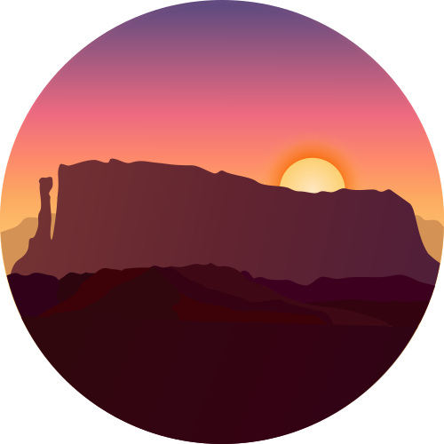
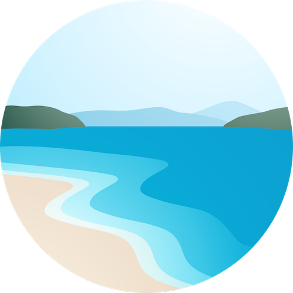
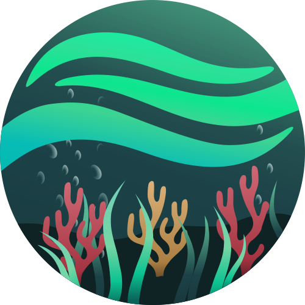
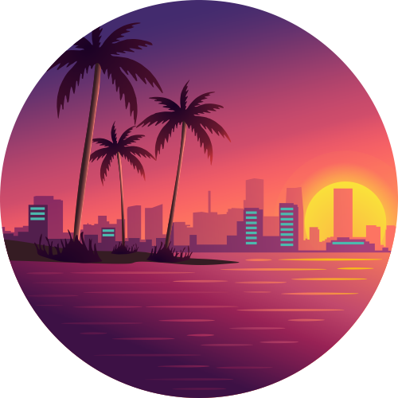
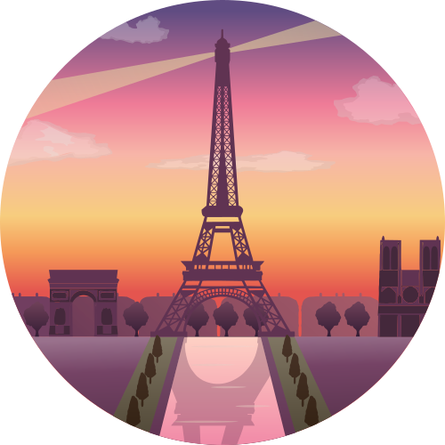
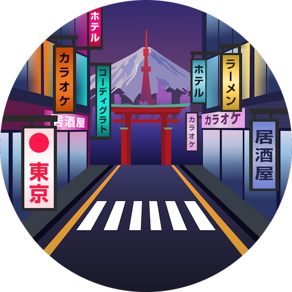

   

<h1 align="center">
Codigrate Themes
</h1>

A carefully crafted collection of themes inspired by nature and iconic cities around the world.
Each theme is designed with balance, readability, and long coding sessions in mind—blending distinctive atmospheres
with thoughtfully tuned colors that reduce eye strain and enhance focus.
Whether you prefer calm, light environments or deep, immersive dark palettes,
these themes aim to make your workspace both visually inspiring and comfortably productive.

## Getting Started

1. Install a compatible JetBrains IDE, such as IntelliJ IDEA, CLion, PyCharm, or other IntelliJ-based IDEs.
2. Launch the IDE and open plugin settings.
3. Search for **the name of the theme** and click install.
4. After installing the theme, go to **Settings | Appearance and Behavior | Appearance** and select **the name of the
   theme** in the theme dropdown. Once you have selected one of the theme options, click the OK button to apply the
   changes.

## Troubleshooting

There is a minor IntelliJ bug that you may face while updating the theme.
So, to not have that issue, please follow the steps below:

1. If you are using the theme that you want to update, select another theme first.
2. Then update the theme.
3. Then restart the ide.
4. Finally, switch it back to the theme that you updated.

<h1 align="center">
Nature
</h1>

<table> 
   <tr>
      <td align="center">
            
             
      </td>
      <td align="left">
         <a href="https://plugins.jetbrains.com/plugin/22653-everest-theme">
            
             
            
             
            
         </a>
      </td> 
   </tr>
</table>

<!-- THEMES-LIST:START - Do not remove or modify this section -->
<!-- prettier-ignore-start -->
<!-- markdownlint-disable -->
<table> 
   <tr>
      <td colspan="2" align="center">
         Light Themes ☀️
      </td>
      <td colspan="2" align="center">
         Dark Themes 🌑
      </td>
   </tr>
   <tr>
      <td align="center">
         <a href="https://plugins.jetbrains.com/plugin/22653-everest-theme">
            
             
            
               <b>Everest</b>
            
         </a>
      </td>
      <td align="left">
         <a href="https://plugins.jetbrains.com/plugin/22653-everest-theme">
            
             
            
             
            
         </a>
      </td> 
      <td align="center">
         <a href="https://plugins.jetbrains.com/plugin/22487-aurora-borealis-theme">
            
             
            
               <b>Aurora Borealis</b>
            
         </a>
      </td>
      <td align="left">
         <a href="https://plugins.jetbrains.com/plugin/22487-aurora-borealis-theme">
            
             
            
             
            
         </a>
      </td>
   </tr>
   <tr>
      <td align="center">
         <a href="https://plugins.jetbrains.com/plugin/22872-sakura-theme">
            
             
            
               <b>Sakura</b>
            
         </a>
      </td>
      <td align="left">
         <a href="https://github.com/codigrate/jetbrains-themes/tree/main/nature/sequoia-theme">
            
             
            
             
            
         </a>
      </td>
      <td align="center">
         <a href="https://github.com/codigrate/jetbrains-themes/tree/main/nature/sequoia-theme">
            
             
            
               <b>Sequoia</b>
            
         </a>
      </td>
      <td align="left">
         <a href="https://plugins.jetbrains.com/plugin/22826-sequoia-theme">
            
             
            
             
            
         </a>
      </td>
   </tr>
   <tr>
      <td align="center">
         <a href="https://plugins.jetbrains.com/plugin/22700-autumn-theme">
            
             
            
               <b>Autumn</b>
            
         </a>
      </td>
      <td align="left">
         <a href="https://plugins.jetbrains.com/plugin/22700-autumn-theme">
            
             
            
             
            
         </a>
      </td> 
      <td align="center">
         <a href="https://plugins.jetbrains.com/plugin/22961-roraima-theme">
            
             
            
               <b>Roraima</b>
            
         </a>
      </td>
      <td align="left">
         <a href="https://plugins.jetbrains.com/plugin/22961-roraima-theme">
            
             
            
             
            
         </a>
      </td>
   </tr>
   <tr>
      <td align="center">
         <a href="https://plugins.jetbrains.com/vendor/Codigrate">
            
             
            
               <b>Salda</b>
            
         </a>
      </td>
      <td align="left">
         <a href="https://plugins.jetbrains.com/vendor/Codigrate">
            
             
            
             
            
         </a>
      </td> 
      <td align="center">
         <a href="https://plugins.jetbrains.com/vendor/Codigrate">
            
             
            
               <b>Ocean</b>
            
         </a>
      </td>
      <td align="left">
         <a href="https://plugins.jetbrains.com/vendor/Codigrate">
            
             
            
             
            
         </a>
      </td> 
   </tr>
</table>

<h1 align="center">
Cities
</h1>

<!-- THEMES-LIST:START - Do not remove or modify this section -->
<!-- prettier-ignore-start -->
<!-- markdownlint-disable -->
<table> 
   <tr>
      <td colspan="2" align="center">
         Light Themes ☀️
      </td>
      <td colspan="2" align="center">
         Dark Themes 🌑
      </td>
   </tr>
   <tr>
      <td align="center">
         <a href="https://plugins.jetbrains.com/plugin/29590-istanbul-theme">
            
             
            
               <b>Istanbul</b>
            
         </a>
      </td>
      <td align="left">
         <a href="https://plugins.jetbrains.com/plugin/29590-istanbul-theme">
            
             
            
             
            
         </a>
      </td>
      <td align="center">
         <a href="https://plugins.jetbrains.com/plugin/29582-miami-theme">
            
             
            
               <b>Miami</b>
            
         </a>
      </td>
      <td align="left">
         <a href="https://plugins.jetbrains.com/plugin/29582-miami-theme">
            
             
            
             
            
         </a>
      </td>
   </tr>
   <tr>
      <td align="center">
         <a href="https://plugins.jetbrains.com/plugin/29621-rio-de-janeiro">
            
             
            
               <b>Rio de Janeiro</b>
            
         </a>
      </td>
      <td align="left">
         <a href="https://plugins.jetbrains.com/plugin/29621-rio-de-janeiro-theme">
            
             
            
             
            
         </a>
      </td>
      <td align="center">
         <a href="https://plugins.jetbrains.com/plugin/29603-paris-theme">
            
             
            
               <b>Paris</b>
            
         </a>
      </td>
      <td align="left">
         <a href="https://plugins.jetbrains.com/plugin/29603-paris-theme">
            
             
            
             
            
         </a>
      </td>
   </tr>
   <tr>
      <td align="center">
         <a href="https://plugins.jetbrains.com/plugin/29671-tallinn-theme">
            
             
            
               <b>Tallinn</b>
            
         </a>
      </td>
      <td align="left">
         <a href="https://plugins.jetbrains.com/plugin/29671-tallinn-theme">
            
             
            
             
            
         </a>
      </td>
      <td align="center">
         <a href="https://plugins.jetbrains.com/plugin/29646-tokyo-theme">
            
             
            
               <b>Tokyo</b>
            
         </a>
      </td>
      <td align="left">
         <a href="https://plugins.jetbrains.com/plugin/29646-tokyo-theme">
            
             
            
             
            
         </a>
      </td>
   </tr>
</table>

<!-- markdownlint-enable -->
<!-- prettier-ignore-end -->

<!-- THEMES-LIST:END -->

## Contributors

<!-- ALL-CONTRIBUTORS-LIST:START - Do not remove or modify this section -->
<!-- prettier-ignore-start -->
<!-- markdownlint-disable -->
<table>
   <tr>
      <td align="center"><a href="https://github.com/furknyavuz"> <b>Furkan Yavuz</b></a> </td>
      <td align="center"><a href="https://github.com/kerimalp"> <b>Kerim Alp Kaya</b></a> </td>
   </tr>
</table>

<!-- markdownlint-enable -->
<!-- prettier-ignore-end -->

<!-- ALL-CONTRIBUTORS-LIST:END -->

## LICENSE

The source code for this project is released under the [MIT License](LICENSE).

 

<table align="right"><tr><td></td><td><b>Codigrate © 2024</b></td></tr></table>

