

   

<h1 align="center">
Codigrate Themes for Jetbrains
</h1>

A carefully crafted collection of themes inspired by nature and iconic cities around the world.
Each theme is designed with balance, readability, and long coding sessions in mind—blending distinctive atmospheres
with thoughtfully tuned colors that reduce eye strain and enhance focus.
Whether you prefer calm, light environments or deep, immersive dark palettes,
these themes aim to make your workspace both visually inspiring and comfortably productive.

## Getting Started

1. Install a compatible JetBrains IDE, such as IntelliJ IDEA, CLion, PyCharm, or other IntelliJ-based IDEs.
2. Launch the IDE and open plugin settings.
3. Search for **the name of the theme** and click install.
4. After installing the theme, go to **Settings | Appearance and Behavior | Appearance** and select **the name of the
   theme** in the theme dropdown. Once you have selected one of the theme options, click the OK button to apply the
   changes.

## Troubleshooting

There is a minor IntelliJ bug that you may face while updating the theme.
So, to not have that issue, please follow the steps below:

1. If you are using the theme that you want to update, select another theme first.
2. Then update the theme.
3. Then restart the ide.
4. Finally, switch it back to the theme that you updated.

## Nature

   

<h1 align="center">
Everest
</h1>

## Description

Inspired by the majestic heights and serene landscapes of Mount Everest, this light theme aims to provide a calming and
focused coding environment. The soft blues and grays mimic the icy terrains, while subtle hints of warmer colors evoke
the golden hues of dawn breaking over snow-capped peaks.

## Screenshots

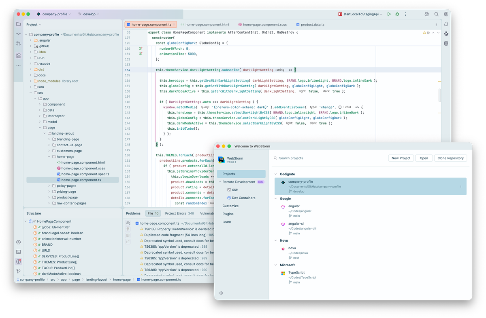

## Color Palette

<table>
   <tr>
      <td></td>
      <td>
         Editor Background
      </td>
      <td>
         <a href="https://codigrate.com/en-US/tools/color/FDFEFF">#FDFEFF</a>
      </td>
   </tr>
   <tr>
      <td></td>
      <td>
         Window Background
      </td>
      <td>
         <a href="https://codigrate.com/en-US/tools/color/E4ECEF">#E4ECEF</a>
      </td>
   </tr>
   <tr>
      <td></td>
      <td>
         Local Variables
      </td>
      <td>
         <a href="https://codigrate.com/en-US/tools/color/1A6D9F">#1A6D9F</a>
      </td>
   </tr>
   <tr>
      <td></td>
      <td>
         Strings and Numbers
      </td>
      <td>
         <a href="https://codigrate.com/en-US/tools/color/005E79">#005E79</a>
      </td>
   </tr>
   <tr>
      <td></td>
      <td>
         Instance Fields
      </td>
      <td>
         <a href="https://codigrate.com/en-US/tools/color/007A47">#007A47</a>
      </td>
   </tr>
   <tr>
      <td></td>
      <td>
         Keywords
      </td>
      <td>
         <a href="https://codigrate.com/en-US/tools/color/2E674F">#2E674F</a>
      </td>
   </tr>
   <tr>
      <td></td>
      <td>
         Static Fields
      </td>
      <td>
         <a href="https://codigrate.com/en-US/tools/color/83529B">#83529B</a>
      </td>
   </tr>
   <tr>
      <td></td>
      <td>
         Global Variables
      </td>
      <td>
         <a href="https://codigrate.com/en-US/tools/color/8C4069">#8C4069</a>
      </td>
   </tr>
   <tr>
      <td></td>
      <td>
         Active Border Colors
      </td>
      <td>
         <a href="https://codigrate.com/en-US/tools/color/ED7E5A">#ED7E5A</a>
      </td>
   </tr>
   <tr>
      <td></td>
      <td>
         Parameters
      </td>
      <td>
         <a href="https://codigrate.com/en-US/tools/color/8F4446">#8F4446</a>
      </td>
   </tr>
</table>

---

   

<h1 align="center">
Aurora Borealis
</h1>

## Description

Inspired by the natural phenomena of the Aurora Borealis, this dark theme captures the majesty and mystery of the Arctic
night sky. Dark blues and teals serve as the backdrop, while lighter accents echo the ethereal colors of the Northern
Lights. The palette is designed to be straightforward on the eyes, helping you focus and code efficiently.

## Screenshots

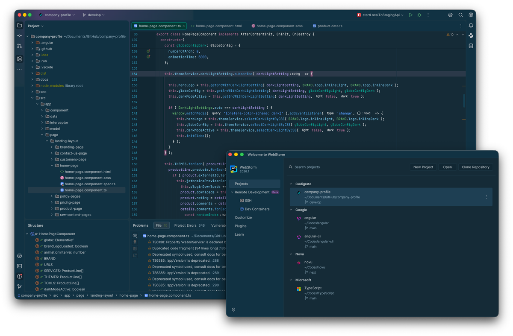

## Color Palette

<table>
   <tr>
      <td></td>
      <td>
         Editor Background
      </td>
      <td>
         <a href="https://codigrate.com/en-US/tools/color/142B37">#142B37</a>
      </td>
   </tr>
   <tr>
      <td></td>
      <td>
         Window Background
      </td>
      <td>
         <a href="https://codigrate.com/en-US/tools/color/183240">#183240</a>
      </td>
   </tr>
   <tr>
      <td></td>
      <td>
         Strings and Numbers
      </td>
      <td>
         <a href="https://codigrate.com/en-US/tools/color/549EFF">#549EFF</a>
      </td>
   </tr>
   <tr>
      <td></td>
      <td>
         Instance Fields
      </td>
      <td>
         <a href="https://codigrate.com/en-US/tools/color/7ACEF5">#7ACEF5</a>
      </td>
   </tr>
   <tr>
      <td></td>
      <td>
         Tab Colors
      </td>
      <td>
         <a href="https://codigrate.com/en-US/tools/color/043A33">#043A33</a>
      </td>
   </tr>
   <tr>
      <td></td>
      <td>
         Global Variables
      </td>
      <td>
         <a href="https://codigrate.com/en-US/tools/color/73D379">#73D379</a>
      </td>
   </tr>
   <tr>
      <td></td>
      <td>
         Local Variables
      </td>
      <td>
         <a href="https://codigrate.com/en-US/tools/color/05C0A6">#05C0A6</a>
      </td>
   </tr>
   <tr>
      <td></td>
      <td>
         Keywords
      </td>
      <td>
         <a href="https://codigrate.com/en-US/tools/color/BB719B">#BB719B</a>
      </td>
   </tr>
   <tr>
      <td></td>
      <td>
         Static Fields
      </td>
      <td>
         <a href="https://codigrate.com/en-US/tools/color/D193BB">#D193BB</a>
      </td>
   </tr>
   <tr>
      <td></td>
      <td>
         Parameters
      </td>
      <td>
         <a href="https://codigrate.com/en-US/tools/color/BAA5FF">#BAA5FF</a>
      </td>
   </tr>
</table>

---

   

<h1 align="center">
Sakura
</h1>

## Description

Inspired by the enchanting allure of Sakura blossoms, this theme encapsulates the soft, calming essence of spring.
Delicate pinks serve as the backdrop, representing the blossoms, while muted greens and blues act as
complementary accents, reflecting the tranquil garden and clear sky. The palette, akin to a serene, blooming Sakura
garden, is designed to be straightforward on the eyes, aiding focus and efficient coding.

## Screenshots

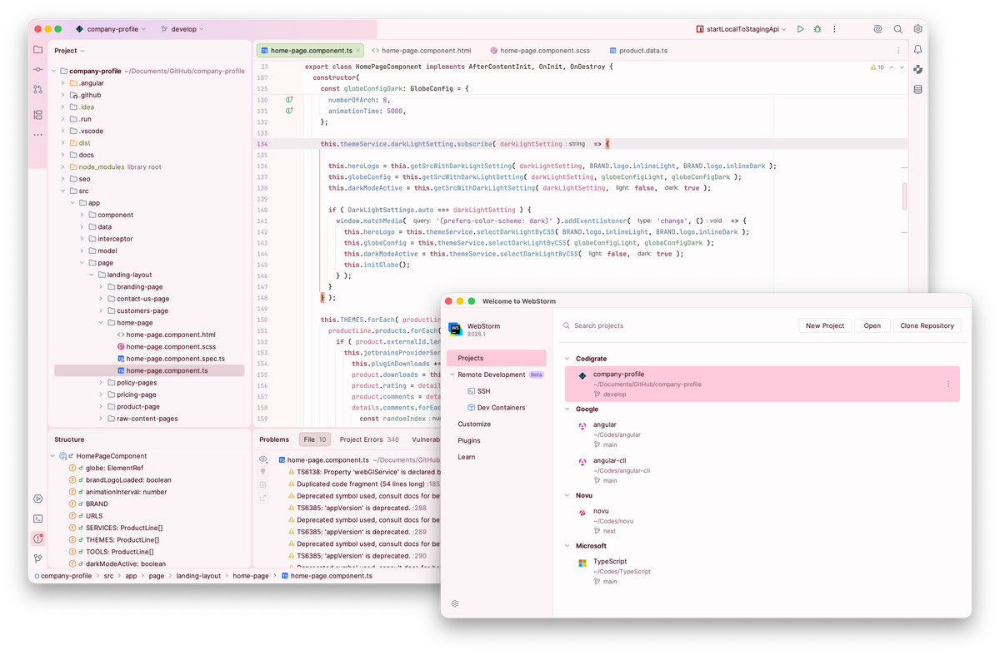

## Color Palette

<table>
   <tr>
      <td></td>
      <td>
         Editor Background
      </td>
      <td>
         <a href="https://codigrate.com/en-US/tools/color/FEFCFC">#FEFCFC</a>
      </td>
   </tr>
   <tr>
      <td></td>
      <td>
         Surface Background
      </td>
      <td>
         <a href="https://codigrate.com/en-US/tools/color/F8DBE6">#F8DBE6</a>
      </td>
   </tr>
   <tr>
      <td></td>
      <td>
         Selection Background
      </td>
      <td>
         <a href="https://codigrate.com/en-US/tools/color/FFC9DC">#FFC9DC</a>
      </td>
   </tr>
   <tr>
      <td></td>
      <td>
         Parameters
      </td>
      <td>
         <a href="https://codigrate.com/en-US/tools/color/CB6B91">#CB6B91</a>
      </td>
   </tr>
   <tr>
      <td></td>
      <td>
         Keywords
      </td>
      <td>
         <a href="https://codigrate.com/en-US/tools/color/98556C">#98556C</a>
      </td>
   </tr>
   <tr>
      <td></td>
      <td>
         Active Background
      </td>
      <td>
         <a href="https://codigrate.com/en-US/tools/color/DBEACB">#DBEACB</a>
      </td>
   </tr>
   <tr>
      <td></td>
      <td>
         Local Variables
      </td>
      <td>
         <a href="https://codigrate.com/en-US/tools/color/618C71">#618C71</a>
      </td>
   </tr>
   <tr>
      <td></td>
      <td>
         Static Fields
      </td>
      <td>
         <a href="https://codigrate.com/en-US/tools/color/69A2BD">#69A2BD</a>
      </td>
   </tr>
   <tr>
      <td></td>
      <td>
         Instance Fields
      </td>
      <td>
         <a href="https://codigrate.com/en-US/tools/color/607FA9">#607FA9</a>
      </td>
   </tr>
   <tr>
      <td></td>
      <td>
         Global Variables
      </td>
      <td>
         <a href="https://codigrate.com/en-US/tools/color/687788">#687788</a>
      </td>
   </tr>
</table>

---

   

<h1 align="center">
Sequoia
</h1>

## Description

Inspired by the towering presence and serene environment of sequoias, it envelops your IDE in deep blacks
and browns, providing a calm and focused coding atmosphere. Accents of vibrant green illuminate the interface subtly,
mirroring the vitality of these magnificent trees. Venture into the digital woods and let its
grounded, tranquil palette guide you through the logical forest of your code efficiently.

## Screenshots

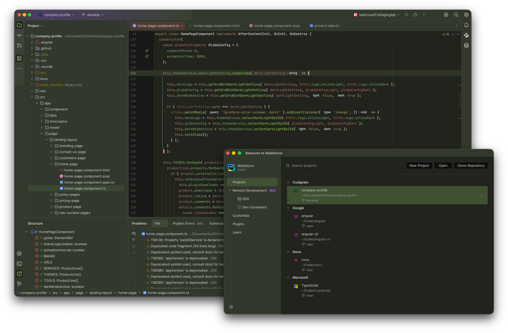

## Color Palette

<table>
   <tr>
      <td></td>
      <td>
         Editor Background
      </td>
      <td>
         <a href="https://codigrate.com/en-US/tools/color/20231C">#20231C</a>
      </td>
   </tr>
   <tr>
      <td></td>
      <td>
         Window Background
      </td>
      <td>
         <a href="https://codigrate.com/en-US/tools/color/32382C">#32382C</a>
      </td>
   </tr>
   <tr>
      <td></td>
      <td>
         Selection Background
      </td>
      <td>
         <a href="https://codigrate.com/en-US/tools/color/405133">#405133</a>
      </td>
   </tr>
   <tr>
      <td></td>
      <td>
         Instance Fields
      </td>
      <td>
         <a href="https://codigrate.com/en-US/tools/color/6E9F56">#6E9F56</a>
      </td>
   </tr>
   <tr>
      <td></td>
      <td>
         Static Fields
      </td>
      <td>
         <a href="https://codigrate.com/en-US/tools/color/369772">#369772</a>
      </td>
   </tr>
   <tr>
      <td></td>
      <td>
         Strings
      </td>
      <td>
         <a href="https://codigrate.com/en-US/tools/color/A68F59">#A68F59</a>
      </td>
   </tr>
   <tr>
      <td></td>
      <td>
         Keywords
      </td>
      <td>
         <a href="https://codigrate.com/en-US/tools/color/A67B5B">#A67B5B</a>
      </td>
   </tr>
   <tr>
      <td></td>
      <td>
         Local Variables
      </td>
      <td>
         <a href="https://codigrate.com/en-US/tools/color/A86255">#A86255</a>
      </td>
   </tr>
   <tr>
      <td></td>
      <td>
         Parameters
      </td>
      <td>
         <a href="https://codigrate.com/en-US/tools/color/986969">#986969</a>
      </td>
   </tr>
   <tr>
      <td></td>
      <td>
         Comments
      </td>
      <td>
         <a href="https://codigrate.com/en-US/tools/color/6C625A">#6C625A</a>
      </td>
   </tr>
</table>

---

   

<h1 align="center">
Autumn
</h1>

## Description

Inspired by the warm hues and rustic feel of autumn, this light theme aims to evoke a sense of comfort and
tranquility. It blends soothing earth tones and crisp air-like whites, capturing the essence of fall leaves and late
afternoon sunlight. The palette is designed to be gentle on the eyes, promoting focus and productivity.

## Screenshots

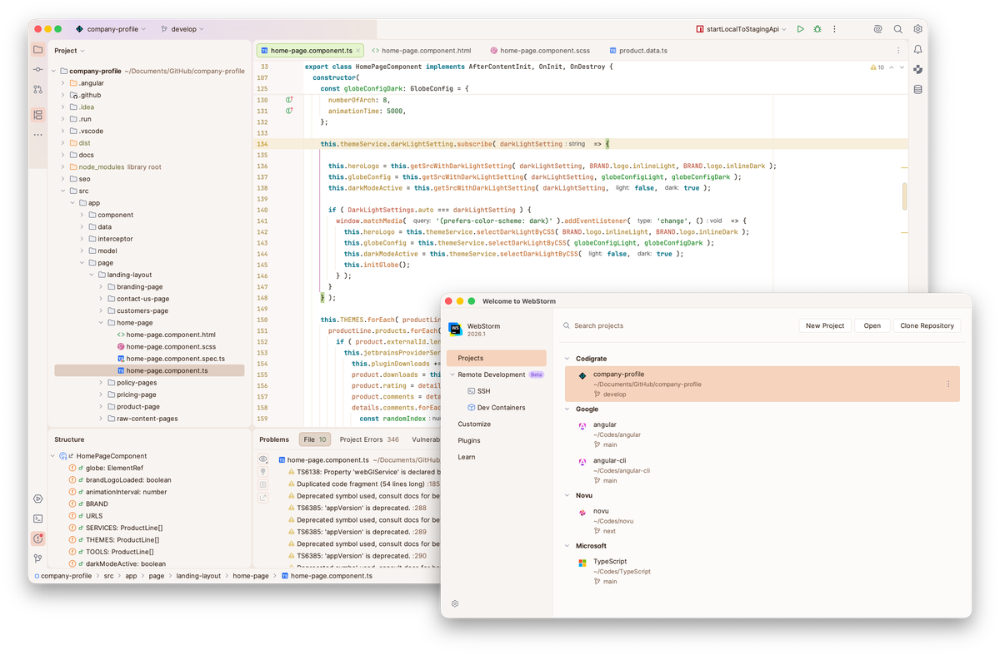

## Color Palette

<table>
   <tr>
      <td></td>
      <td>
         Window Background
      </td>
      <td>
         <a href="https://codigrate.com/en-US/tools/color/F8F4F1">#F8F4F1</a>
      </td>
   </tr>
   <tr>
      <td></td>
      <td>
         Selection Background
      </td>
      <td>
         <a href="https://codigrate.com/en-US/tools/color/F4D3BD">#F4D3BD</a>
      </td>
   </tr>
   <tr>
      <td></td>
      <td>
         Global Variables
      </td>
      <td>
         <a href="https://codigrate.com/en-US/tools/color/BE553E">#BE553E</a>
      </td>
   </tr>
   <tr>
      <td></td>
      <td>
         Metadata
      </td>
      <td>
         <a href="https://codigrate.com/en-US/tools/color/773918">#773918</a>
      </td>
   </tr>
   <tr>
      <td></td>
      <td>
         Parameters
      </td>
      <td>
         <a href="https://codigrate.com/en-US/tools/color/B0633A">#B0633A</a>
      </td>
   </tr>
   <tr>
      <td></td>
      <td>
         Instance Fields
      </td>
      <td>
         <a href="https://codigrate.com/en-US/tools/color/A87F25">#A87F25</a>
      </td>
   </tr>
   <tr>
      <td></td>
      <td>
         Alternate Background
      </td>
      <td>
         <a href="https://codigrate.com/en-US/tools/color/F5B211">#F5B211</a>
      </td>
   </tr>
   <tr>
      <td></td>
      <td>
         Strings and Numbers
      </td>
      <td>
         <a href="https://codigrate.com/en-US/tools/color/1B591E">#1B591E</a>
      </td>
   </tr>
   <tr>
      <td></td>
      <td>
         Local Variables
      </td>
      <td>
         <a href="https://codigrate.com/en-US/tools/color/0E8113">#0E8113</a>
      </td>
   </tr>
   <tr>
      <td></td>
      <td>
         Keywords
      </td>
      <td>
         <a href="https://codigrate.com/en-US/tools/color/006E83">#006E83</a>
      </td>
   </tr>
</table>

---

   

<h1 align="center">
   Roraima
</h1>

## Description

Inspired by the captivating sunset over Mount Roraima, this dark theme seamlessly blends the deep twilight hues of
blues and purples with the fiery brilliance of oranges and yellows. Evoking the serene majesty of Roraima as day
transitions to night, this balanced palette offers a soothing yet invigorating backdrop, ensuring an optimal and
focused coding experience.

## Screenshots

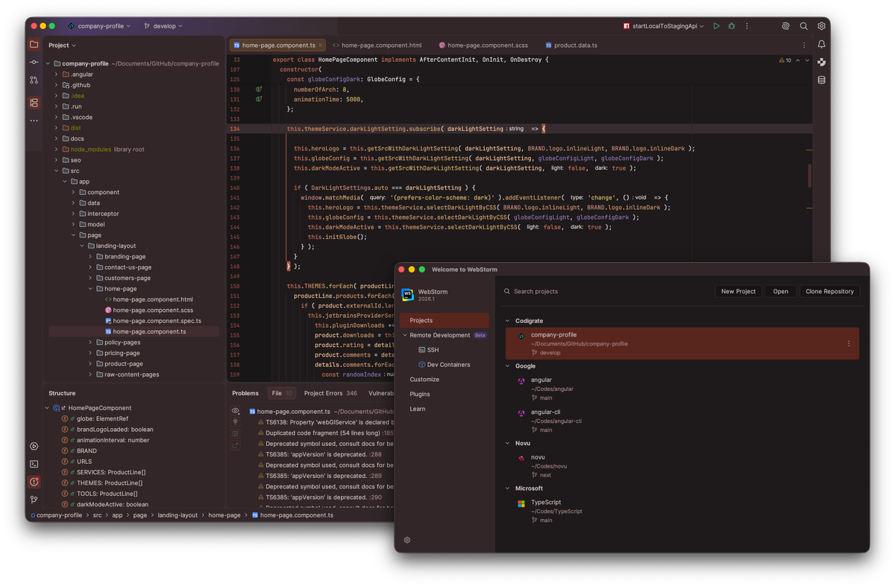

## Color Palette

<table>
   <tr>
      <td></td>
      <td>
         Editor Background
      </td>
      <td>
         <a href="https://codigrate.com/en-US/tools/color/1E1A1B">#1E1A1B</a>
      </td>
   </tr>
   <tr>
      <td></td>
      <td>
         Window Background
      </td>
      <td>
         <a href="https://codigrate.com/en-US/tools/color/322628">#322628</a>
      </td>
   </tr>
   <tr>
      <td></td>
      <td>
         Selection Background
      </td>
      <td>
         <a href="https://codigrate.com/en-US/tools/color/5A261E">#5A261E</a>
      </td>
   </tr>
   <tr>
      <td></td>
      <td>
         Keywords
      </td>
      <td>
         <a href="https://codigrate.com/en-US/tools/color/D17458">#D17458</a>
      </td>
   </tr>
   <tr>
      <td></td>
      <td>
         Instance Fields
      </td>
      <td>
         <a href="https://codigrate.com/en-US/tools/color/D69568">#D69568</a>
      </td>
   </tr>
   <tr>
      <td></td>
      <td>
         Metadata
      </td>
      <td>
         <a href="https://codigrate.com/en-US/tools/color/D1BA46">#D1BA46</a>
      </td>
   </tr>
   <tr>
      <td></td>
      <td>
         Strings
      </td>
      <td>
         <a href="https://codigrate.com/en-US/tools/color/DDBE6D">#DDBE6D</a>
      </td>
   </tr>
   <tr>
      <td></td>
      <td>
         Static Fields
      </td>
      <td>
         <a href="https://codigrate.com/en-US/tools/color/ED8B8B">#ED8B8B</a>
      </td>
   </tr>
   <tr>
      <td></td>
      <td>
         Local Variables
      </td>
      <td>
         <a href="https://codigrate.com/en-US/tools/color/8F78B7">#8F78B7</a>
      </td>
   </tr>
   <tr>
      <td></td>
      <td>
         Tag Name
      </td>
      <td>
         <a href="https://codigrate.com/en-US/tools/color/7E6AA3">#7E6AA3</a>
      </td>
   </tr>
</table>

---

   

<h1 align="center">
   Salda
    
   (Premium)
</h1>

## Description

Inspired by the crystalline waters and bright white shores of Salda Lake, this light theme brings fresh, airy calm to
your IDE.
Clean lake blues and vibrant turquoise tones create a clear, spacious backdrop, while soft beige keeps everything crisp
and readable.
The palette is designed to be gentle on the eyes, helping you stay focused and code with clarity.

## Screenshots

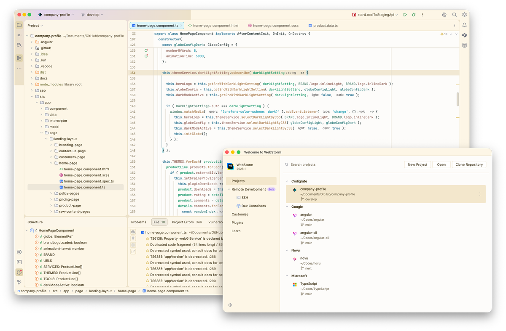

## Color Palette

<table>
   <tr>
      <td></td>
      <td>
         Editor Background
      </td>
      <td>
         <a href="https://codigrate.com/en-US/tools/color/FDFCFA">#FDFCFA</a>
      </td>
   </tr>
   <tr>
      <td></td>
      <td>
         Window Background
      </td>
      <td>
         <a href="https://codigrate.com/en-US/tools/color/FDF6E7">#FDF6E7</a>
      </td>
   </tr>
   <tr>
      <td></td>
      <td>
         Surface Background
      </td>
      <td>
         <a href="https://codigrate.com/en-US/tools/color/ECE1C9">#ECE1C9</a>
      </td>
   </tr>
   <tr>
      <td></td>
      <td>
         Metadata
      </td>
      <td>
         <a href="https://codigrate.com/en-US/tools/color/A59379">#A59379</a>
      </td>
   </tr>
   <tr>
      <td></td>
      <td>
         Instance Fields
      </td>
      <td>
         <a href="https://codigrate.com/en-US/tools/color/8F6055">#8F6055</a>
      </td>
   </tr>
   <tr>
      <td></td>
      <td>
         Search Background
      </td>
      <td>
         <a href="https://codigrate.com/en-US/tools/color/B8E4EC">#B8E4EC</a>
      </td>
   </tr>
   <tr>
      <td></td>
      <td>
         Strings
      </td>
      <td>
         <a href="https://codigrate.com/en-US/tools/color/1397AE">#1397AE</a>
      </td>
   </tr>
   <tr>
      <td></td>
      <td>
         Keywords
      </td>
      <td>
         <a href="https://codigrate.com/en-US/tools/color/44849F">#44849F</a>
      </td>
   </tr>
   <tr>
      <td></td>
      <td>
         Local Variables
      </td>
      <td>
         <a href="https://codigrate.com/en-US/tools/color/277878">#277878</a>
      </td>
   </tr>
   <tr>
      <td></td>
      <td>
         Parameters
      </td>
      <td>
         <a href="https://codigrate.com/en-US/tools/color/0F9363">#0F9363</a>
      </td>
   </tr>
</table>

---

   <a href="https://plugins.jetbrains.com/plugin/30132-all-in-one-themes">
    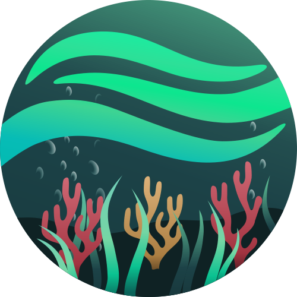
  </a>

<h1 align="center">
   Ocean
    
   (Premium)
</h1>

## Description

Inspired by the deep and tranquil world of the ocean, this dark theme seamlessly blends layered dark teal tones with
soft
cyan highlights and subtle bioluminescent accents. This balanced palette offers a calm and immersive backdrop,
ensuring an optimal and focused coding experience.

## Screenshots

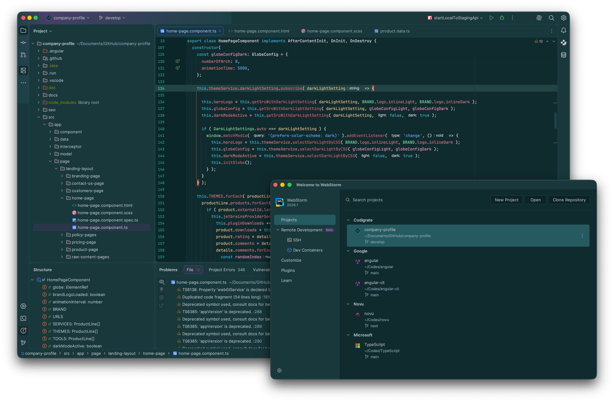

## Color Palette

<table>
   <tr>
      <td></td>
      <td>
         Editor Background
      </td>
      <td>
         <a href="https://codigrate.com/en-US/tools/color/102B2E">#102B2E</a>
      </td>
   </tr>
   <tr>
      <td></td>
      <td>
         Window Background
      </td>
      <td>
         <a href="https://codigrate.com/en-US/tools/color/18383C">#18383C</a>
      </td>
   </tr>
   <tr>
      <td></td>
      <td>
         Surface Background
      </td>
      <td>
         <a href="https://codigrate.com/en-US/tools/color/1C4247">#1C4247</a>
      </td>
   </tr>
   <tr>
      <td></td>
      <td>
         Tags
      </td>
      <td>
         <a href="https://codigrate.com/en-US/tools/color/5AB590">#5AB590</a>
      </td>
   </tr>
   <tr>
      <td></td>
      <td>
         Keywords
      </td>
      <td>
         <a href="https://codigrate.com/en-US/tools/color/3FB4D8">#3FB4D8</a>
      </td>
   </tr>
   <tr>
      <td></td>
      <td>
         Static Fields
      </td>
      <td>
         <a href="https://codigrate.com/en-US/tools/color/B88BDA">#B88BDA</a>
      </td>
   </tr>
   <tr>
      <td></td>
      <td>
         Local Variables
      </td>
      <td>
         <a href="https://codigrate.com/en-US/tools/color/EE8EBF">#EE8EBF</a>
      </td>
   </tr>
   <tr>
      <td></td>
      <td>
         Instance Fields
      </td>
      <td>
         <a href="https://codigrate.com/en-US/tools/color/DC7783">#DC7783</a>
      </td>
   </tr>
   <tr>
      <td></td>
      <td>
         Attributes
      </td>
      <td>
         <a href="https://codigrate.com/en-US/tools/color/DC9577">#DC9577</a>
      </td>
   </tr>
   <tr>
      <td></td>
      <td>
         Parameters
      </td>
      <td>
         <a href="https://codigrate.com/en-US/tools/color/EAC089">#EAC089</a>
      </td>
   </tr>
</table>

---

   <a href="https://plugins.jetbrains.com/plugin/30132-all-in-one-themes">
    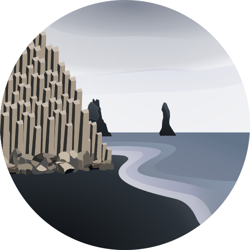
  </a>

<h1 align="center">
   Reynisfjara
    
   (Premium)
</h1>

## Description

Inspired by the dramatic and windswept shores of Reynisfjara, this dark theme blends deep charcoal surfaces with cool 
steel-blue tones and subtle icy highlights. The layered contrast between shadowy backgrounds and soft gray-blue accents 
creates a calm yet striking visual balance, offering a focused and immersive coding environment.

## Screenshots

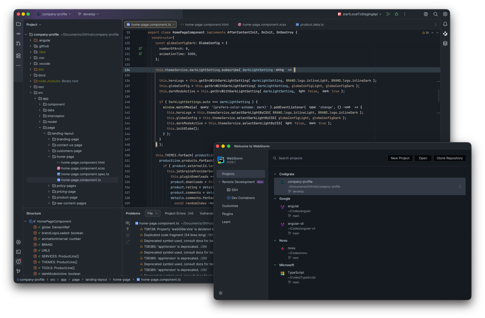

## Color Palette

<table>
   <tr>
      <td></td>
      <td>
         Input Background
      </td>
      <td>
         <a href="https://codigrate.com/en-US/tools/color/060709">#060709</a>
      </td>
   </tr>
   <tr>
      <td></td>
      <td>
         Editor Background
      </td>
      <td>
         <a href="https://codigrate.com/en-US/tools/color/151A20">#151A20</a>
      </td>
   </tr>
   <tr>
      <td></td>
      <td>
         Window Background
      </td>
      <td>
         <a href="https://codigrate.com/en-US/tools/color/20262C">#20262C</a>
      </td>
   </tr>
   <tr>
      <td></td>
      <td>
         Surface Background
      </td>
      <td>
         <a href="https://codigrate.com/en-US/tools/color/2A3138">#2A3138</a>
      </td>
   </tr>
   <tr>
      <td></td>
      <td>
         Selection Border
      </td>
      <td>
         <a href="https://codigrate.com/en-US/tools/color/7D848D">#7D848D</a>
      </td>
   </tr>
   <tr>
      <td></td>
      <td>
         Alternate Background
      </td>
      <td>
         <a href="https://codigrate.com/en-US/tools/color/8E8276">#8E8276</a>
      </td>
   </tr>
   <tr>
      <td></td>
      <td>
         Keywords
      </td>
      <td>
         <a href="https://codigrate.com/en-US/tools/color/AC8563">#AC8563</a>
      </td>
   </tr>
   <tr>
      <td></td>
      <td>
         Local Variables
      </td>
      <td>
         <a href="https://codigrate.com/en-US/tools/color/C5A98F">#C5A98F</a>
      </td>
   </tr>
   <tr>
      <td></td>
      <td>
         Instance Fields
      </td>
      <td>
         <a href="https://codigrate.com/en-US/tools/color/C3B9AD">#C3B9AD</a>
      </td>
   </tr>
   <tr>
      <td></td>
      <td>
         Tags
      </td>
      <td>
         <a href="https://codigrate.com/en-US/tools/color/B1AC9B">#B1AC9B</a>
      </td>
   </tr>
</table>

---

   

<h1 align="center">
   Spring
    
   (Premium)
</h1>

## Description

Inspired by the vibrant and refreshing essence of the spring season, this light theme brings a sense of renewal to your 
coding environment. Soft greens, floral pinks, and warm earth tones work together to create a bright yet soothing 
palette, designed to enhance focus and provide a pleasant visual experience during long development sessions.

## Screenshots

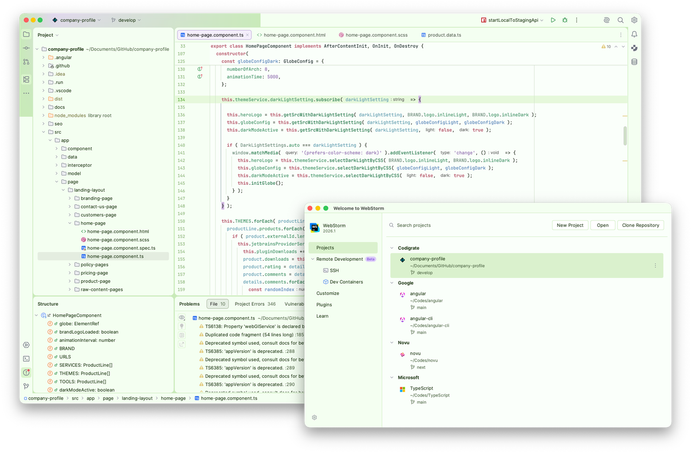

## Color Palette

<table>
   <tr>
      <td></td>
      <td>
         Window Background
      </td>
      <td>
         <a href="https://codigrate.com/en-US/tools/color/F4FFF1">#F4FFF1</a>
      </td>
   </tr>
   <tr>
      <td></td>
      <td>
         Surface Background
      </td>
      <td>
         <a href="https://codigrate.com/en-US/tools/color/C8EAB9">#C8EAB9</a>
      </td>
   </tr>
   <tr>
      <td></td>
      <td>
         Tags
      </td>
      <td>
         <a href="https://codigrate.com/en-US/tools/color/559569">#559569</a>
      </td>
   </tr>
   <tr>
      <td></td>
      <td>
         Instance Fields
      </td>
      <td>
         <a href="https://codigrate.com/en-US/tools/color/3C8F63">#3C8F63</a>
      </td>
   </tr>
   <tr>
      <td></td>
      <td>
         Keywords
      </td>
      <td>
         <a href="https://codigrate.com/en-US/tools/color/BA6173">#BA6173</a>
      </td>
   </tr>
   <tr>
      <td></td>
      <td>
         Attributes
      </td>
      <td>
         <a href="https://codigrate.com/en-US/tools/color/BD7070">#BD7070</a>
      </td>
   </tr>
   <tr>
      <td></td>
      <td>
         Strings
      </td>
      <td>
         <a href="https://codigrate.com/en-US/tools/color/8C68AC">#8C68AC</a>
      </td>
   </tr>
   <tr>
      <td></td>
      <td>
         Alternate Background
      </td>
      <td>
         <a href="https://codigrate.com/en-US/tools/color/AD91D0">#AD91D0</a>
      </td>
   </tr>
   <tr>
      <td></td>
      <td>
         Local Variables
      </td>
      <td>
         <a href="https://codigrate.com/en-US/tools/color/527FB6">#527FB6</a>
      </td>
   </tr>
   <tr>
      <td></td>
      <td>
         Parameters
      </td>
      <td>
         <a href="https://codigrate.com/en-US/tools/color/5E9AAE">#5E9AAE</a>
      </td>
   </tr>
</table>

## Cities

   

<h1 align="center">
Istanbul
</h1>

## Description

Inspired by the soft daylight and sea breezes of Istanbul, this theme blends calm turquoise tones with warm
historical accents to create a serene yet expressive coding environment. Light, airy backgrounds keep the
editor clean and comfortable, while teals, aquas, and muted golden hues add clarity and focus to essential
syntax elements.

## Screenshots

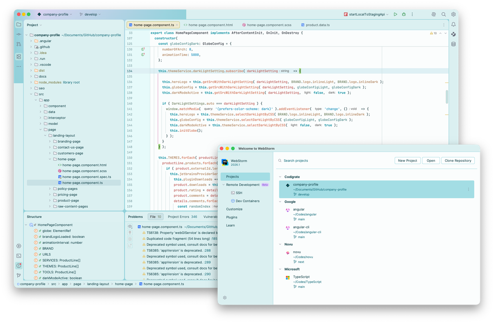

## Color Palette

<table>
   <tr>
      <td></td>
      <td>
         Editor Background
      </td>
      <td>
         <a href="https://codigrate.com/en-US/tools/color/FAFDFD">#FAFDFD</a>
      </td>
   </tr>
   <tr>
      <td></td>
      <td>
         Window Background
      </td>
      <td>
         <a href="https://codigrate.com/en-US/tools/color/DBF0F1">#DBF0F1</a>
      </td>
   </tr>
   <tr>
      <td></td>
      <td>
         Selection Background
      </td>
      <td>
         <a href="https://codigrate.com/en-US/tools/color/A3DDE5">#A3DDE5</a>
      </td>
   </tr>
   <tr>
      <td></td>
      <td>
         Keywords
      </td>
      <td>
         <a href="https://codigrate.com/en-US/tools/color/1190A1">#1190A1</a>
      </td>
   </tr>
   <tr>
      <td></td>
      <td>
         Strings
      </td>
      <td>
         <a href="https://codigrate.com/en-US/tools/color/0887B5">#0887B5</a>
      </td>
   </tr>
   <tr>
      <td></td>
      <td>
         Active Background
      </td>
      <td>
         <a href="https://codigrate.com/en-US/tools/color/EFEAD0">#EFEAD0</a>
      </td>
   </tr>
   <tr>
      <td></td>
      <td>
         Attributes
      </td>
      <td>
         <a href="https://codigrate.com/en-US/tools/color/B87958">#B87958</a>
      </td>
   </tr>
   <tr>
      <td></td>
      <td>
         Parameters
      </td>
      <td>
         <a href="https://codigrate.com/en-US/tools/color/B8514D">#B8514D</a>
      </td>
   </tr>
   <tr>
      <td></td>
      <td>
         Tags
      </td>
      <td>
         <a href="https://codigrate.com/en-US/tools/color/C16979">#C16979</a>
      </td>
   </tr>
   <tr>
      <td></td>
      <td>
         Metadata
      </td>
      <td>
         <a href="https://codigrate.com/en-US/tools/color/9C6E7C">#9C6E7C</a>
      </td>
   </tr>
</table>

---

   

<h1 align="center">
Miami
</h1>

## Description

Inspired by the electric nights and pastel sunsets of Miami, this theme blends deep purples with vibrant neon accents
to create a bold yet balanced coding environment. Dark, warm backgrounds ground the editor, while vivid pinks, corals,
and tropical teals bring energy and clarity to key syntax elements.

## Screenshots

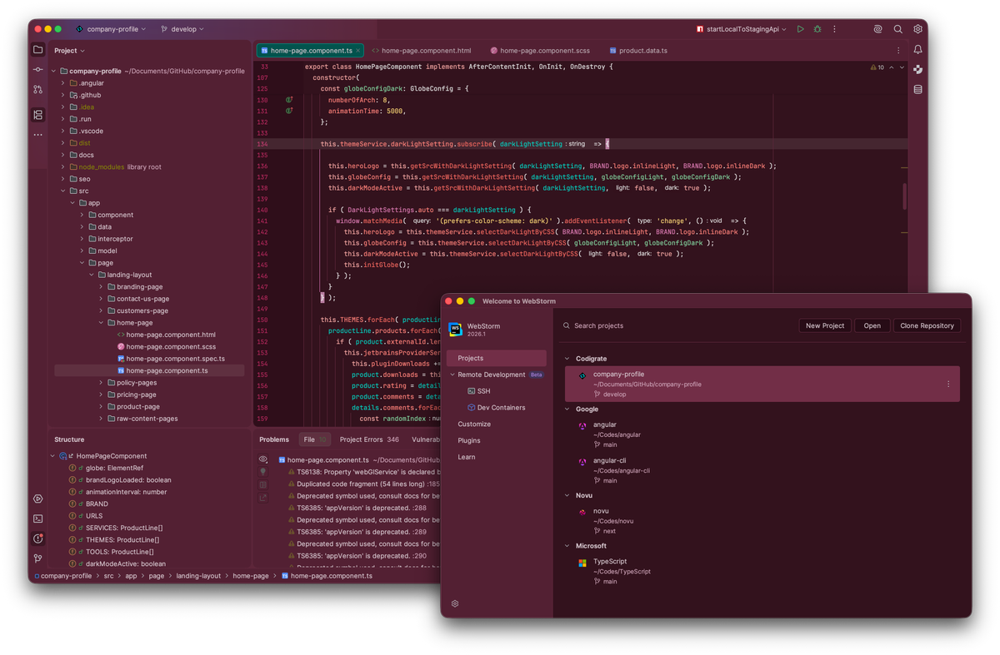

## Color Palette

<table>
   <tr>
      <td></td>
      <td>
         Editor Background
      </td>
      <td>
         <a href="https://codigrate.com/en-US/tools/color/33121D">#33121D</a>
      </td>
   </tr>
   <tr>
      <td></td>
      <td>
         Window Background
      </td>
      <td>
         <a href="https://codigrate.com/en-US/tools/color/532033">#532033</a>
      </td>
   </tr>
   <tr>
      <td></td>
      <td>
         Accent Color
      </td>
      <td>
         <a href="https://codigrate.com/en-US/tools/color/FF5FA2">#FF5FA2</a>
      </td>
   </tr>
   <tr>
      <td></td>
      <td>
         Tag Colors
      </td>
      <td>
         <a href="https://codigrate.com/en-US/tools/color/FE788C">#FE788C</a>
      </td>
   </tr>
   <tr>
      <td></td>
      <td>
         Instance Fields
      </td>
      <td>
         <a href="https://codigrate.com/en-US/tools/color/FE8078">#FE8078</a>
      </td>
   </tr>
   <tr>
      <td></td>
      <td>
         Keywords
      </td>
      <td>
         <a href="https://codigrate.com/en-US/tools/color/F2A4A0">#F2A4A0</a>
      </td>
   </tr>
   <tr>
      <td></td>
      <td>
         Static Fields
      </td>
      <td>
         <a href="https://codigrate.com/en-US/tools/color/92B5E8">#92B5E8</a>
      </td>
   </tr>
   <tr>
      <td></td>
      <td>
         Parameters
      </td>
      <td>
         <a href="https://codigrate.com/en-US/tools/color/00D1C1">#00D1C1</a>
      </td>
   </tr>
   <tr>
      <td></td>
      <td>
         Variables
      </td>
      <td>
         <a href="https://codigrate.com/en-US/tools/color/82D59F">#82D59F</a>
      </td>
   </tr>
   <tr>
      <td></td>
      <td>
         Strings
      </td>
      <td>
         <a href="https://codigrate.com/en-US/tools/color/F8D273">#F8D273</a>
      </td>
   </tr>
</table>

---

   

<h1 align="center">
Rio de Janeiro
</h1>

## Description

Inspired by Rio's lush hills, soft morning light, and ocean air, this theme blends airy minty
backgrounds with confident rainforest greens and clean coastal blues. The editor stays bright and
calm for long sessions, while crisp greens and balanced accents keep syntax readable and focused.

## Screenshots

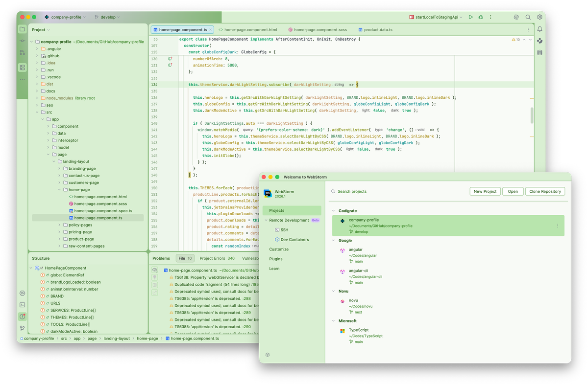

## Color Palette

<table>
   <tr>
      <td></td>
      <td>
         Editor Background
      </td>
      <td>
         <a href="https://codigrate.com/en-US/tools/color/F7FAF6">#F7FAF6</a>
      </td>
   </tr>
   <tr>
      <td></td>
      <td>
         Window Background
      </td>
      <td>
         <a href="https://codigrate.com/en-US/tools/color/DAEAD6">#DAEAD6</a>
      </td>
   </tr>
   <tr>
      <td></td>
      <td>
         Surface Background
      </td>
      <td>
         <a href="https://codigrate.com/en-US/tools/color/94B98B">#94B98B</a>
      </td>
   </tr>
   <tr>
      <td></td>
      <td>
         Keywords
      </td>
      <td>
         <a href="https://codigrate.com/en-US/tools/color/5F9849">#5F9849</a>
      </td>
   </tr>
   <tr>
      <td></td>
      <td>
         Local Variables
      </td>
      <td>
         <a href="https://codigrate.com/en-US/tools/color/247A4C">#247A4C</a>
      </td>
   </tr>
   <tr>
      <td></td>
      <td>
         Strings
      </td>
      <td>
         <a href="https://codigrate.com/en-US/tools/color/10569C">#10569C</a>
      </td>
   </tr>
   <tr>
      <td></td>
      <td>
         Metadata
      </td>
      <td>
         <a href="https://codigrate.com/en-US/tools/color/0A80B3">#0A80B3</a>
      </td>
   </tr>
   <tr>
      <td></td>
      <td>
         Instance Fields
      </td>
      <td>
         <a href="https://codigrate.com/en-US/tools/color/7A6D14">#7A6D14</a>
      </td>
   </tr>
   <tr>
      <td></td>
      <td>
         Attributes
      </td>
      <td>
         <a href="https://codigrate.com/en-US/tools/color/938920">#938920</a>
      </td>
   </tr>
   <tr>
      <td></td>
      <td>
         Alternate Background
      </td>
      <td>
         <a href="https://codigrate.com/en-US/tools/color/E6C41A">#E6C41A</a>
      </td>
   </tr>
</table>

---

   

<h1 align="center">
Paris
</h1>

## Description

Inspired by elegant boulevards and Paris's sunset glow, this theme trades bright champagne for dusty
rose accents over calm plum-espresso tones. Soft dark editor backgrounds keep focus clear, while mauve
surfaces and wine-tinted hovers add depth and balance, with a gentle blush accent guiding attention
across the interface.

## Screenshots

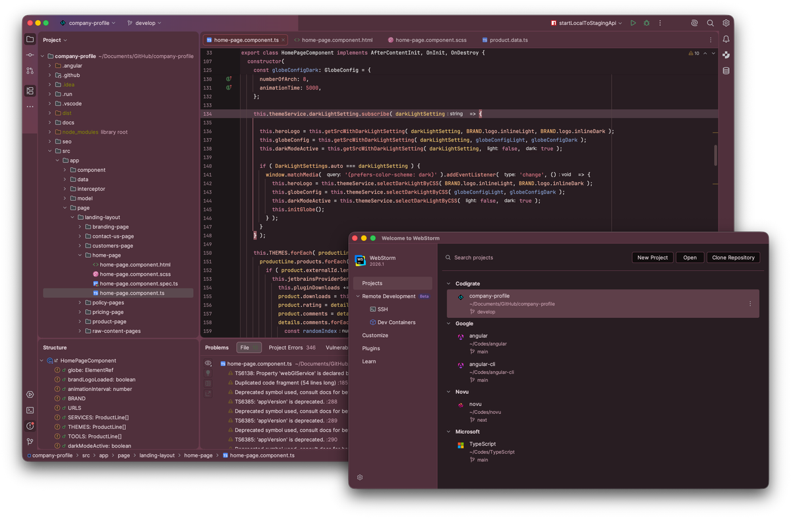

## Color Palette

<table>
   <tr>
      <td></td>
      <td>
         Editor Background
      </td>
      <td>
         <a href="https://codigrate.com/en-US/tools/color/281D22">#281D22</a>
      </td>
   </tr>
   <tr>
      <td></td>
      <td>
         Window Background
      </td>
      <td>
         <a href="https://codigrate.com/en-US/tools/color/4F303C">#4F303C</a>
      </td>
   </tr>
   <tr>
      <td></td>
      <td>
         Surface Background
      </td>
      <td>
         <a href="https://codigrate.com/en-US/tools/color/6A3C4D">#6A3C4D</a>
      </td>
   </tr>
   <tr>
      <td></td>
      <td>
         Keywords
      </td>
      <td>
         <a href="https://codigrate.com/en-US/tools/color/D584A3">#D584A3</a>
      </td>
   </tr>
   <tr>
      <td></td>
      <td>
         Strings
      </td>
      <td>
         <a href="https://codigrate.com/en-US/tools/color/DF7583">#DF7583</a>
      </td>
   </tr>
   <tr>
      <td></td>
      <td>
         Instance Fields
      </td>
      <td>
         <a href="https://codigrate.com/en-US/tools/color/F3B7A9">#F3B7A9</a>
      </td>
   </tr>
   <tr>
      <td></td>
      <td>
         Global Variables
      </td>
      <td>
         <a href="https://codigrate.com/en-US/tools/color/FBBA77">#FBBA77</a>
      </td>
   </tr>
   <tr>
      <td></td>
      <td>
         Parameters
      </td>
      <td>
         <a href="https://codigrate.com/en-US/tools/color/F1C970">#F1C970</a>
      </td>
   </tr>
   <tr>
      <td></td>
      <td>
         Alternate Background
      </td>
      <td>
         <a href="https://codigrate.com/en-US/tools/color/5E7BB3">#5E7BB3</a>
      </td>
   </tr>
   <tr>
      <td></td>
      <td>
         Local Variables
      </td>
      <td>
         <a href="https://codigrate.com/en-US/tools/color/87A1D3">#87A1D3</a>
      </td>
   </tr>
</table>

---

   

<h1 align="center">
Tallinn
</h1>

## Description

Inspired by Tallinn's crisp light and Baltic calm, this theme pairs airy porcelain backgrounds with cool
Nordic blues for a clean, focused coding experience. Soft, bright surfaces enhance readability, while deep
ink accents and subtle lavender-rose highlights add clarity and warmth without losing their minimal Northern character.

## Screenshots

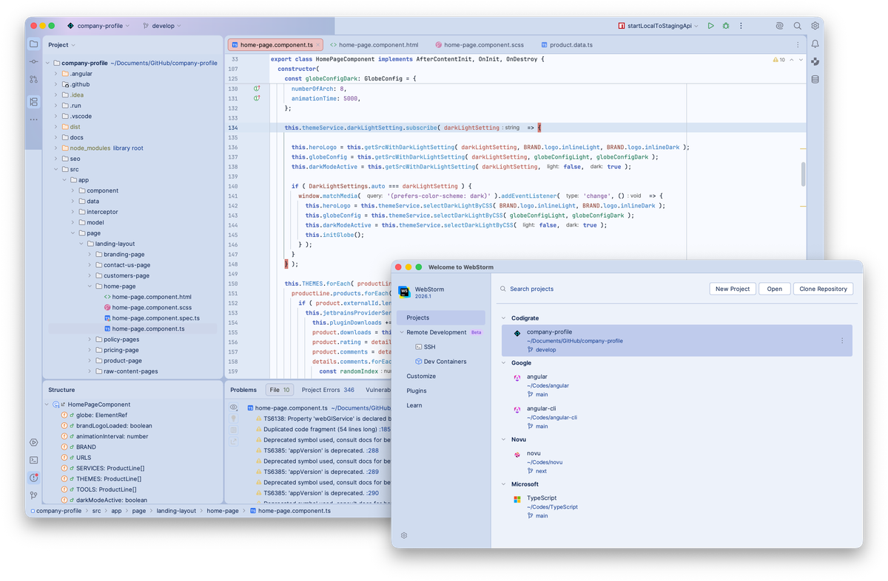

## Color Palette

<table>
   <tr>
      <td></td>
      <td>
         Editor Background
      </td>
      <td>
         <a href="https://codigrate.com/en-US/tools/color/EDF2FA">#EDF2FA</a>
      </td>
   </tr>
   <tr>
      <td></td>
      <td>
         Window Background
      </td>
      <td>
         <a href="https://codigrate.com/en-US/tools/color/D0DCEF">#D0DCEF</a>
      </td>
   </tr>
   <tr>
      <td></td>
      <td>
         Instance Fields
      </td>
      <td>
         <a href="https://codigrate.com/en-US/tools/color/377CC1">#377CC1</a>
      </td>
   </tr>
   <tr>
      <td></td>
      <td>
         Keywords
      </td>
      <td>
         <a href="https://codigrate.com/en-US/tools/color/425EB8">#425EB8</a>
      </td>
   </tr>
   <tr>
      <td></td>
      <td>
         Accent Color
      </td>
      <td>
         <a href="https://codigrate.com/en-US/tools/color/324979">#324979</a>
      </td>
   </tr>
   <tr>
      <td></td>
      <td>
         Strings
      </td>
      <td>
         <a href="https://codigrate.com/en-US/tools/color/81549C">#81549C</a>
      </td>
   </tr>
   <tr>
      <td></td>
      <td>
         Parameters
      </td>
      <td>
         <a href="https://codigrate.com/en-US/tools/color/B6564B">#B6564B</a>
      </td>
   </tr>
   <tr>
      <td></td>
      <td>
         Tag Colors
      </td>
      <td>
         <a href="https://codigrate.com/en-US/tools/color/B1544B">#B1544B</a>
      </td>
   </tr>
   <tr>
      <td></td>
      <td>
         Static Fields
      </td>
      <td>
         <a href="https://codigrate.com/en-US/tools/color/548A64">#548A64</a>
      </td>
   </tr>
   <tr>
      <td></td>
      <td>
         Local Variables
      </td>
      <td>
         <a href="https://codigrate.com/en-US/tools/color/1E7857">#1E7857</a>
      </td>
   </tr>
</table>

---

   <a href="https://plugins.jetbrains.com/plugin/29646-tokyo-theme">
    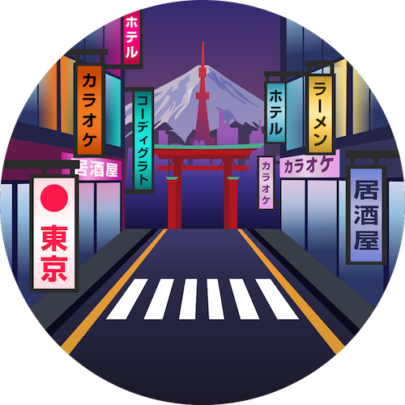
  </a>

<h1 align="center">
Tokyo
</h1>

## Description

Inspired by Tokyo's neon-lit side streets, midnight skylines, and the quiet glow of lantern-lined alleys, this theme
blends deep indigo shadows with electric violet highlights to create a sleek, futuristic coding atmosphere.
Moody blues keep the editor calm and focused, while luminous purples, soft lilacs, and crisp cyan accents add
clarity and energy to key syntax elements.

## Screenshots

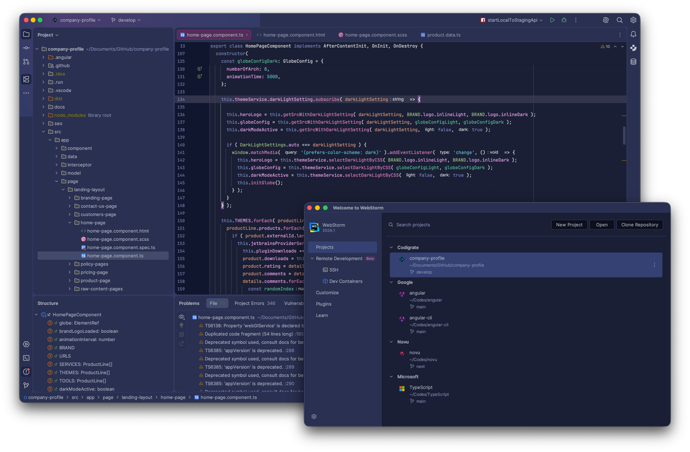

## Color Palette

<table>
   <tr>
      <td></td>
      <td>
         Editor Background
      </td>
      <td>
         <a href="https://codigrate.com/en-US/tools/color/1A1F35">#1A1F35</a>
      </td>
   </tr>
   <tr>
      <td></td>
      <td>
         Window Background
      </td>
      <td>
         <a href="https://codigrate.com/en-US/tools/color/2A3051">#2A3051</a>
      </td>
   </tr>
   <tr>
      <td></td>
      <td>
         Keywords
      </td>
      <td>
         <a href="https://codigrate.com/en-US/tools/color/7B89C8">#7B89C8</a>
      </td>
   </tr>
   <tr>
      <td></td>
      <td>
         Tag Colors
      </td>
      <td>
         <a href="https://codigrate.com/en-US/tools/color/7FA0DD">#7FA0DD</a>
      </td>
   </tr>
   <tr>
      <td></td>
      <td>
         Accent Color
      </td>
      <td>
         <a href="https://codigrate.com/en-US/tools/color/7285DC">#7285DC</a>
      </td>
   </tr>
   <tr>
      <td></td>
      <td>
         Instance Fields
      </td>
      <td>
         <a href="https://codigrate.com/en-US/tools/color/ECA1EB">#ECA1EB</a>
      </td>
   </tr>
   <tr>
      <td></td>
      <td>
         Static Fields
      </td>
      <td>
         <a href="https://codigrate.com/en-US/tools/color/D3B690">#D3B690</a>
      </td>
   </tr>
   <tr>
      <td></td>
      <td>
         Parameters
      </td>
      <td>
         <a href="https://codigrate.com/en-US/tools/color/DD9B7F">#DD9B7F</a>
      </td>
   </tr>
   <tr>
      <td></td>
      <td>
         Variables
      </td>
      <td>
         <a href="https://codigrate.com/en-US/tools/color/5CC19D">#5CC19D</a>
      </td>
   </tr>
   <tr>
      <td></td>
      <td>
         Strings
      </td>
      <td>
         <a href="https://codigrate.com/en-US/tools/color/5DC8D6">#5DC8D6</a>
      </td>
   </tr>
</table>

---

   

<h1 align="center">
   Sydney
    
   (Premium)
</h1>

## Description

Inspired by Sydney’s bright harbor mornings, salt-air breezes, and soft coastal light, this theme keeps the editor clean
and airy with porcelain whites and misty blues. Gentle ocean surfaces and clear selections preserve focus, while a deep
teal accent and warm sandstone highlights add contrast across tabs, borders, and search matches without losing the calm,
sunlit feel.

## Screenshots

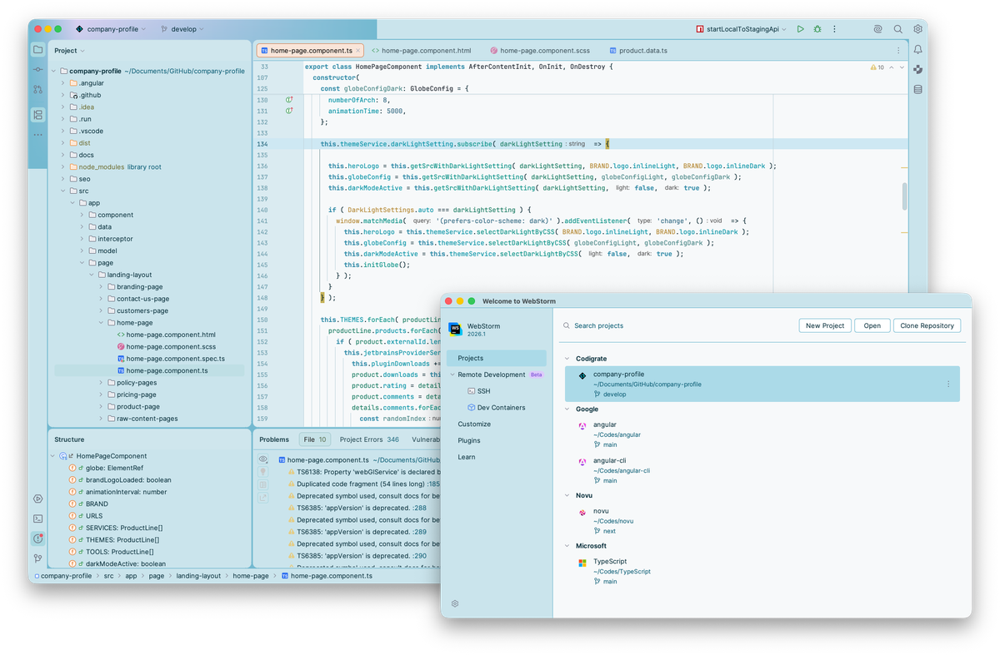

## Color Palette

<table>
   <tr>
      <td></td>
      <td>
         Editor Background
      </td>
      <td>
         <a href="https://codigrate.com/en-US/tools/color/F6F9FA">#F6F9FA</a>
      </td>
   </tr>
   <tr>
      <td></td>
      <td>
         Window Background
      </td>
      <td>
         <a href="https://codigrate.com/en-US/tools/color/CAE4EC">#CAE4EC</a>
      </td>
   </tr>
   <tr>
      <td></td>
      <td>
         Surface Background
      </td>
      <td>
         <a href="https://codigrate.com/en-US/tools/color/73B9D0">#73B9D0</a>
      </td>
   </tr>
   <tr>
      <td></td>
      <td>
         Selection Border
      </td>
      <td>
         <a href="https://codigrate.com/en-US/tools/color/169DC5">#169DC5</a>
      </td>
   </tr>
   <tr>
      <td></td>
      <td>
         Keywords
      </td>
      <td>
         <a href="https://codigrate.com/en-US/tools/color/2E89A6">#2E89A6</a>
      </td>
   </tr>
   <tr>
      <td></td>
      <td>
         Metadata
      </td>
      <td>
         <a href="https://codigrate.com/en-US/tools/color/2F9383">#2F9383</a>
      </td>
   </tr>
   <tr>
      <td></td>
      <td>
         Alternate Background
      </td>
      <td>
         <a href="https://codigrate.com/en-US/tools/color/DCAD42">#DCAD42</a>
      </td>
   </tr>
   <tr>
      <td></td>
      <td>
         Static Fields
      </td>
      <td>
         <a href="https://codigrate.com/en-US/tools/color/AF8427">#AF8427</a>
      </td>
   </tr>
   <tr>
      <td></td>
      <td>
         Active Border
      </td>
      <td>
         <a href="https://codigrate.com/en-US/tools/color/D17F51">#D17F51</a>
      </td>
   </tr>
   <tr>
      <td></td>
      <td>
         Local Variables
      </td>
      <td>
         <a href="https://codigrate.com/en-US/tools/color/BA7347">#BA7347</a>
      </td>
   </tr>
</table>

---

   

<h1 align="center">
   Prague
    
   (Premium)
</h1>

## Description

Inspired by Prague’s midnight river reflections, gothic silhouettes, and warm lamplight on old stone, this theme pairs
deep cobalt-navy shadows with cool steel blues for a calm, cinematic coding mood. Rich surfaces and crisp selections
keep focus sharp, while a bright sky-blue accent and subtle golden highlights add contrast across tabs, hovers, and
search matches.

## Screenshots

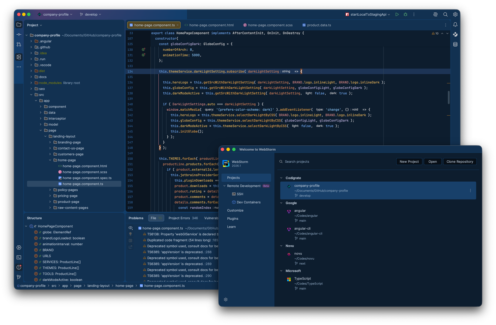

## Color Palette

<table>
   <tr>
      <td></td>
      <td>
         Editor Background
      </td>
      <td>
         <a href="https://codigrate.com/en-US/tools/color/0D1D2E">#0D1D2E</a>
      </td>
   </tr>
   <tr>
      <td></td>
      <td>
         Window Background
      </td>
      <td>
         <a href="https://codigrate.com/en-US/tools/color/123151">#123151</a>
      </td>
   </tr>
   <tr>
      <td></td>
      <td>
         Surface Background
      </td>
      <td>
         <a href="https://codigrate.com/en-US/tools/color/113E6B">#113E6B</a>
      </td>
   </tr>
   <tr>
      <td></td>
      <td>
         Keywords
      </td>
      <td>
         <a href="https://codigrate.com/en-US/tools/color/74ADF8">#74ADF8</a>
      </td>
   </tr>
   <tr>
      <td></td>
      <td>
         Strings
      </td>
      <td>
         <a href="https://codigrate.com/en-US/tools/color/89C5F8">#89C5F8</a>
      </td>
   </tr>
   <tr>
      <td></td>
      <td>
         Comments
      </td>
      <td>
         <a href="https://codigrate.com/en-US/tools/color/92A3B3">#92A3B3</a>
      </td>
   </tr>
   <tr>
      <td></td>
      <td>
         Parameters
      </td>
      <td>
         <a href="https://codigrate.com/en-US/tools/color/DF865B">#DF865B</a>
      </td>
   </tr>
   <tr>
      <td></td>
      <td>
         Instance Fields
      </td>
      <td>
         <a href="https://codigrate.com/en-US/tools/color/EFBA5A">#EFBA5A</a>
      </td>
   </tr>
   <tr>
      <td></td>
      <td>
         Attributes
      </td>
      <td>
         <a href="https://codigrate.com/en-US/tools/color/E3CA77">#E3CA77</a>
      </td>
   </tr>
   <tr>
      <td></td>
      <td>
         Metadata
      </td>
      <td>
         <a href="https://codigrate.com/en-US/tools/color/DCCF9D">#DCCF9D</a>
      </td>
   </tr>
</table>

## Collections

   

<h1 align="center">
All In One Themes
</h1>

## Description

All in One Themes is the complete theme experience in a single package, 
bringing together all Codigrate themes into one unified collection for JetBrains IDEs. 
From calm, light environments inspired by natural landscapes to rich, 
cinematic dark themes shaped by iconic cities, this bundle lets you switch moods, lighting, 
and atmosphere without disrupting your workflow.

## Screenshots

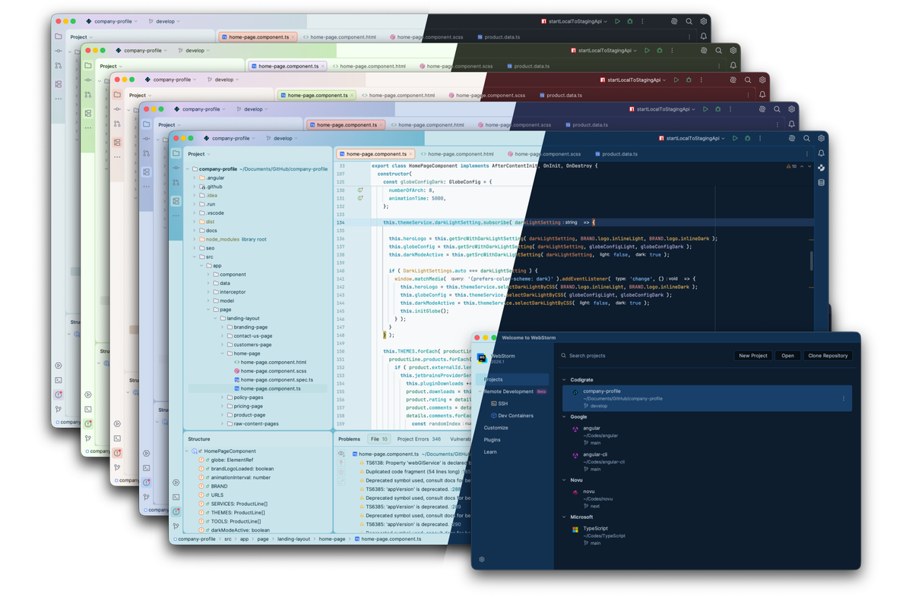

## Discount Community Programs

- Students and teachers (Free)
- Open Source Projects (Free)
- Universities and educational organizations (50% Off)
- Startups (50% Off)
- Non-profit organizations (50% Off)

## Contributors

<!-- ALL-CONTRIBUTORS-LIST:START - Do not remove or modify this section -->
<!-- prettier-ignore-start -->
<!-- markdownlint-disable -->
<table>
   <tr>
      <td align="center"><a href="https://github.com/furknyavuz"> <b>Furkan Yavuz</b></a> </td>
      <td align="center"><a href="https://github.com/kerimalp"> <b>Kerim Alp Kaya</b></a> </td>
   </tr>
</table>

<!-- markdownlint-enable -->
<!-- prettier-ignore-end -->

<!-- ALL-CONTRIBUTORS-LIST:END -->

## LICENSE

The source code for this project is released under the [MIT License](LICENSE).

 

<table align="right"><tr><td></td><td><b>Codigrate © 2026</b></td></tr></table>
