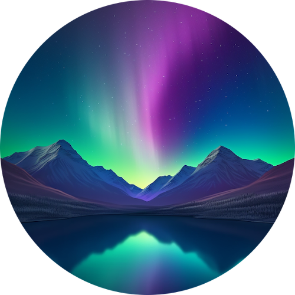
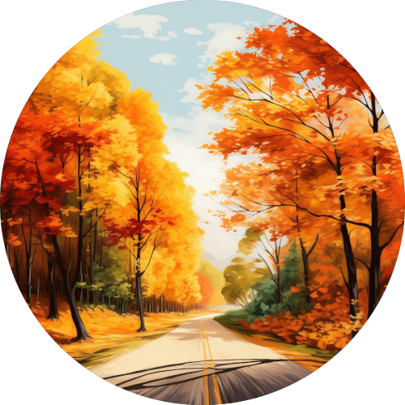

   

<h1 align="center">
Codigrate - Jetbrains Themes
</h1>

<!-- Plugin description -->
Codigrate themes for JetBrains.

After installing a theme, go to Preferences | Appearance and Behavior | Appearance and select one of the new themes in the theme dropdown.
Once you have selected one of the theme options, click the OK button to apply the changes.

<!-- Plugin description end -->

## Themes

<!-- THEMES-LIST:START - Do not remove or modify this section -->
<!-- prettier-ignore-start -->
<!-- markdownlint-disable -->
<table>
  <tr>
    <td align="center">
       <a href="https://plugins.jetbrains.com/plugin/22487-aurora-borealis-theme">
          
           
          
             <b>Aurora Borealis Theme</b>
          
       </a>
    </td>
    <td align="left">
       
        
       
        
       
    </td>
  </tr>
   <tr>
    <td align="center">
       <a href="https://plugins.jetbrains.com/plugin/22653-everest-theme">
          
           
          
             <b>Everest Theme</b>
          
       </a>
    </td>
    <td align="left">
       
        
       
        
       
    </td>
  </tr>
   <tr>
    <td align="center">
       <a href="https://plugins.jetbrains.com/plugin/22700-autumn-theme">
          
           
          
             <b>Autumn Theme</b>
          
       </a>
    </td>
    <td align="left">
       
        
       
        
       
    </td>
  </tr>

   
</table>

<!-- markdownlint-enable -->
<!-- prettier-ignore-end -->

<!-- THEMES-LIST:END -->

## Contributors

<!-- ALL-CONTRIBUTORS-LIST:START - Do not remove or modify this section -->
<!-- prettier-ignore-start -->
<!-- markdownlint-disable -->
<table>
  <tr>
    <td align="center"><a href="https://github.com/furknyavuz"> <b>Furkan Yavuz</b></a> </td>
    <td align="center"><a href="https://github.com/kerimalp"> <b>Kerim Alp Kaya</b></a> </td>
  </tr>
</table>

<!-- markdownlint-enable -->
<!-- prettier-ignore-end -->

<!-- ALL-CONTRIBUTORS-LIST:END -->

## LICENSE

The source code for this project is released under the [MIT License](LICENSE).
