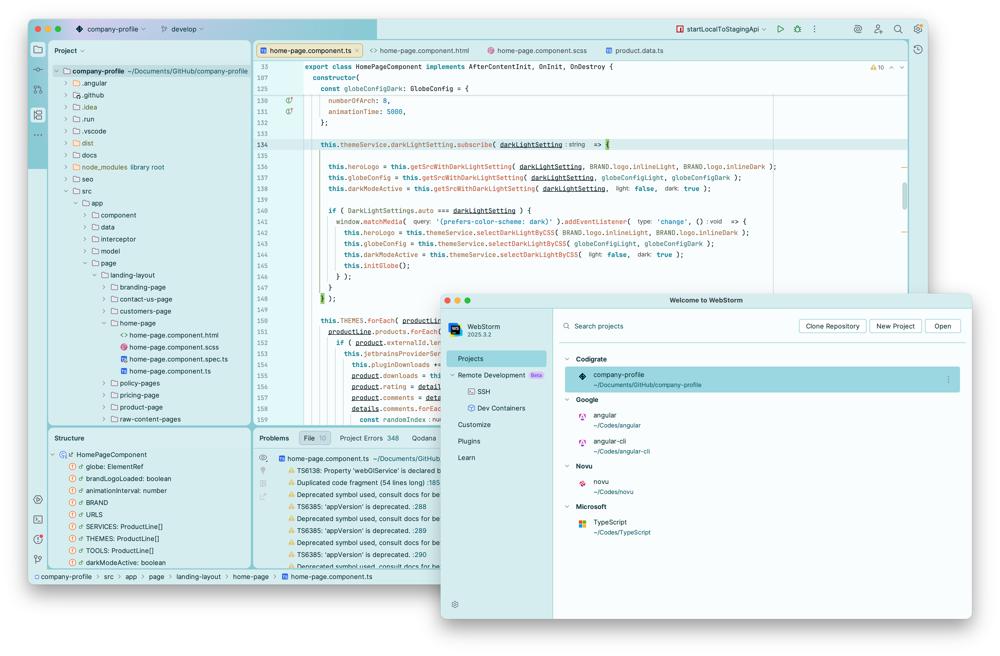

   

<h1 align="center">
Istanbul Theme
</h1>

## Description

Inspired by the soft daylight, sea breezes, and timeless layers of Istanbul, this theme blends calm
turquoise tones with warm historical accents to create a serene yet expressive coding environment.
Light, airy backgrounds keep the editor clean and comfortable, while subtle teals, aquas, and muted
golden hues add clarity and focus to essential syntax elements.

## Screenshots

## Color Palette

<table>
   <tr>
      <td></td>
      <td>
         Editor Background
      </td>
      <td>
         <a href="https://codigrate.com/en-US/tools/color/FAFDFD">#FAFDFD</a>
      </td>
   </tr>
   <tr>
      <td></td>
      <td>
         Window Background
      </td>
      <td>
         <a href="https://codigrate.com/en-US/tools/color/DBF0F1">#DBF0F1</a>
      </td>
   </tr>
   <tr>
      <td></td>
      <td>
         Selection Background
      </td>
      <td>
         <a href="https://codigrate.com/en-US/tools/color/A3DDE5">#A3DDE5</a>
      </td>
   </tr>
   <tr>
      <td></td>
      <td>
         Keywords
      </td>
      <td>
         <a href="https://codigrate.com/en-US/tools/color/1190A1">#1190A1</a>
      </td>
   </tr>
   <tr>
      <td></td>
      <td>
         Strings
      </td>
      <td>
         <a href="https://codigrate.com/en-US/tools/color/0887B5">#0887B5</a>
      </td>
   </tr>
   <tr>
      <td></td>
      <td>
         Active Background
      </td>
      <td>
         <a href="https://codigrate.com/en-US/tools/color/EFEAD0">#EFEAD0</a>
      </td>
   </tr>
   <tr>
      <td></td>
      <td>
         Attributes
      </td>
      <td>
         <a href="https://codigrate.com/en-US/tools/color/B87958">#B87958</a>
      </td>
   </tr>
   <tr>
      <td></td>
      <td>
         Parameters
      </td>
      <td>
         <a href="https://codigrate.com/en-US/tools/color/B8514D">#B8514D</a>
      </td>
   </tr>
   <tr>
      <td></td>
      <td>
         Tags
      </td>
      <td>
         <a href="https://codigrate.com/en-US/tools/color/C16979">#C16979</a>
      </td>
   </tr>
   <tr>
      <td></td>
      <td>
         Metadata
      </td>
      <td>
         <a href="https://codigrate.com/en-US/tools/color/9C6E7C">#9C6E7C</a>
      </td>
   </tr>
</table>

## Getting Started

1. Install a compatible JetBrains IDE, such as IntelliJ IDEA, CLion, PyCharm, or other IntelliJ-based IDEs.
2. Launch the IDE and open plugin settings.
3. Search for **Istanbul Theme** and click install.
4. After installing the theme, go to **Settings | Appearance and Behavior | Appearance** and select **Istanbul
   Theme** in the theme dropdown. Once you have selected one of the theme options, click the OK button to apply the
   changes.

## Troubleshooting

There is a minor IntelliJ bug that you may face while updating the theme.
So, to not have that issue, please follow the steps below:

1. If you are using the theme that you want to update, select another theme first.
2. Then update the theme.
3. Then restart the ide.
4. Finally, switch it back to the theme that you updated.

## Contributors

<!-- ALL-CONTRIBUTORS-LIST:START - Do not remove or modify this section -->
<!-- prettier-ignore-start -->
<!-- markdownlint-disable -->
<table>
  <tr>
    <td align="center"><a href="https://github.com/furknyavuz"> <b>Furkan Yavuz</b></a> </td>
    <td align="center"><a href="https://github.com/kerimalp"> <b>Kerim Alp Kaya</b></a> </td>
  </tr>
</table>

<!-- markdownlint-enable -->
<!-- prettier-ignore-end -->

<!-- ALL-CONTRIBUTORS-LIST:END -->

## LICENSE

The source code for this project is released under the [MIT License](LICENSE).

