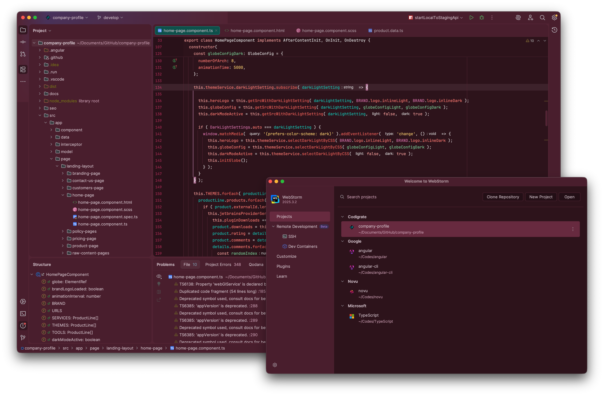

   

<h1 align="center">
Miami - Jetbrains Theme
</h1>

## Description

Inspired by the electric nights and pastel sunsets of Miami, this theme blends deep purples with vibrant neon accents 
to create a bold yet balanced coding environment. Dark, warm backgrounds ground the editor, while vivid pinks, corals, 
and tropical teals bring energy and clarity to key syntax elements. The palette is designed to feel lively without being 
overwhelming—keeping your focus sharp while adding a touch of Miami’s unmistakable nightlife glow to your workflow.

## Screenshots

## Color Palette

<table>
   <tr>
      <td></td>
      <td>
         Editor Background
      </td>
      <td>
         <a href="https://codigrate.com/en-US/tools/color/33121D">#33121D</a>
      </td>
   </tr>
   <tr>
      <td></td>
      <td>
         Window Background
      </td>
      <td>
         <a href="https://codigrate.com/en-US/tools/color/532033">#532033</a>
      </td>
   </tr>
   <tr>
      <td></td>
      <td>
         Accent Color
      </td>
      <td>
         <a href="https://codigrate.com/en-US/tools/color/FF5FA2">#FF5FA2</a>
      </td>
   </tr>
   <tr>
      <td></td>
      <td>
         Tag Colors
      </td>
      <td>
         <a href="https://codigrate.com/en-US/tools/color/FE788C">#FE788C</a>
      </td>
   </tr>
   <tr>
      <td></td>
      <td>
         Instance Fields
      </td>
      <td>
         <a href="https://codigrate.com/en-US/tools/color/FE8078">#FE8078</a>
      </td>
   </tr>
   <tr>
      <td></td>
      <td>
         Keywords
      </td>
      <td>
         <a href="https://codigrate.com/en-US/tools/color/F2A4A0">#F2A4A0</a>
      </td>
   </tr>
   <tr>
      <td></td>
      <td>
         Static Fields
      </td>
      <td>
         <a href="https://codigrate.com/en-US/tools/color/92B5E8">#92B5E8</a>
      </td>
   </tr>
   <tr>
      <td></td>
      <td>
         Parameters
      </td>
      <td>
         <a href="https://codigrate.com/en-US/tools/color/00D1C1">#00D1C1</a>
      </td>
   </tr>
   <tr>
      <td></td>
      <td>
         Variables
      </td>
      <td>
         <a href="https://codigrate.com/en-US/tools/color/82D59F">#82D59F</a>
      </td>
   </tr>
   <tr>
      <td></td>
      <td>
         Strings
      </td>
      <td>
         <a href="https://codigrate.com/en-US/tools/color/F8D273">#F8D273</a>
      </td>
   </tr>
</table>

## Getting Started

1. Install a compatible JetBrains IDE, such as IntelliJ IDEA, CLion, PyCharm, or other IntelliJ-based IDEs.
2. Launch the IDE and open plugin settings.
3. Search for **Aurora Borealis Theme** and click install.
4. After installing the theme, go to **Settings | Appearance and Behavior | Appearance** and select **Aurora Borealis
   Theme** in the theme dropdown. Once you have selected one of the theme options, click the OK button to apply the
   changes.

## Troubleshooting

There is a minor IntelliJ bug that you may face while updating the theme.
So, to not have that issue, please follow the steps below:

1. If you are using the theme that you want to update, select another theme first.
2. Then update the theme.
3. Then restart the ide.
4. Finally, switch it back to the theme that you updated.

## Contributors

<!-- ALL-CONTRIBUTORS-LIST:START - Do not remove or modify this section -->
<!-- prettier-ignore-start -->
<!-- markdownlint-disable -->
<table>
  <tr>
    <td align="center"><a href="https://github.com/furknyavuz"> <b>Furkan Yavuz</b></a> </td>
    <td align="center"><a href="https://github.com/kerimalp"> <b>Kerim Alp Kaya</b></a> </td>
  </tr>
</table>

<!-- markdownlint-enable -->
<!-- prettier-ignore-end -->

<!-- ALL-CONTRIBUTORS-LIST:END -->

## LICENSE

The source code for this project is released under the [MIT License](LICENSE).

