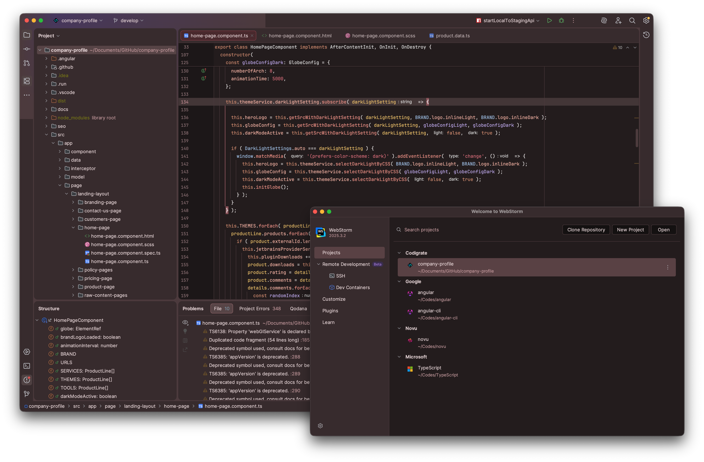

   

<h1 align="center">
Paris
</h1>

## Description

Inspired by candlelit cafes, stone boulevards, and Paris's late-night glow, this theme trades bright
champagne for dusty rose accents over deep plum-espresso shadows. Near-black editor tones keep focus
locked in, while mauve surfaces and wine-tinted hovers bring clarity, with a soft blush accent guiding
focus across the interface.

## Screenshots

## Color Palette

<table>
   <tr>
      <td></td>
      <td>
         Editor Background
      </td>
      <td>
         <a href="https://codigrate.com/en-US/tools/color/271F20">#271F20</a>
      </td>
   </tr>
   <tr>
      <td></td>
      <td>
         Window Background
      </td>
      <td>
         <a href="https://codigrate.com/en-US/tools/color/3F3033">#3F3033</a>
      </td>
   </tr>
   <tr>
      <td></td>
      <td>
         Surface Background
      </td>
      <td>
         <a href="https://codigrate.com/en-US/tools/color/564245">#564245</a>
      </td>
   </tr>
   <tr>
      <td></td>
      <td>
         Strings
      </td>
      <td>
         <a href="https://codigrate.com/en-US/tools/color/DF7583">#DF7583</a>
      </td>
   </tr>
   <tr>
      <td></td>
      <td>
         Accent Color
      </td>
      <td>
         <a href="https://codigrate.com/en-US/tools/color/D39199">#D39199</a>
      </td>
   </tr>
   <tr>
      <td></td>
      <td>
         Instance Fields
      </td>
      <td>
         <a href="https://codigrate.com/en-US/tools/color/F3B7A9">#F3B7A9</a>
      </td>
   </tr>
   <tr>
      <td></td>
      <td>
         Keywords
      </td>
      <td>
         <a href="https://codigrate.com/en-US/tools/color/D89578">#D89578</a>
      </td>
   </tr>
   <tr>
      <td></td>
      <td>
         Tag Colors
      </td>
      <td>
         <a href="https://codigrate.com/en-US/tools/color/D5CFC6">#D5CFC6</a>
      </td>
   </tr>
   <tr>
      <td></td>
      <td>
         Parameters
      </td>
      <td>
         <a href="https://codigrate.com/en-US/tools/color/F1C970">#F1C970</a>
      </td>
   </tr>
   <tr>
      <td></td>
      <td>
         Static Fields
      </td>
      <td>
         <a href="https://codigrate.com/en-US/tools/color/DCC79D">#DCC79D</a>
      </td>
   </tr>
</table>

## Getting Started

1. Install a compatible JetBrains IDE, such as IntelliJ IDEA, CLion, PyCharm, or other IntelliJ-based IDEs.
2. Launch the IDE and open plugin settings.
3. Search for **Paris Theme** and click install.
4. After installing the theme, go to **Settings | Appearance and Behavior | Appearance** and select **Paris** in the theme dropdown. Once you have selected one of the theme options, click the OK button to apply the
   changes.

## Troubleshooting

There is a minor IntelliJ bug that you may face while updating the theme.
So, to not have that issue, please follow the steps below:

1. If you are using the theme that you want to update, select another theme first.
2. Then update the theme.
3. Then restart the ide.
4. Finally, switch it back to the theme that you updated.

## Contributors

<!-- ALL-CONTRIBUTORS-LIST:START - Do not remove or modify this section -->
<!-- prettier-ignore-start -->
<!-- markdownlint-disable -->
<table>
  <tr>
    <td align="center"><a href="https://github.com/furknyavuz"> <b>Furkan Yavuz</b></a> </td>
    <td align="center"><a href="https://github.com/kerimalp"> <b>Kerim Alp Kaya</b></a> </td>
  </tr>
</table>

<!-- markdownlint-enable -->
<!-- prettier-ignore-end -->

<!-- ALL-CONTRIBUTORS-LIST:END -->

## LICENSE

The source code for this project is released under the [MIT License](LICENSE).

