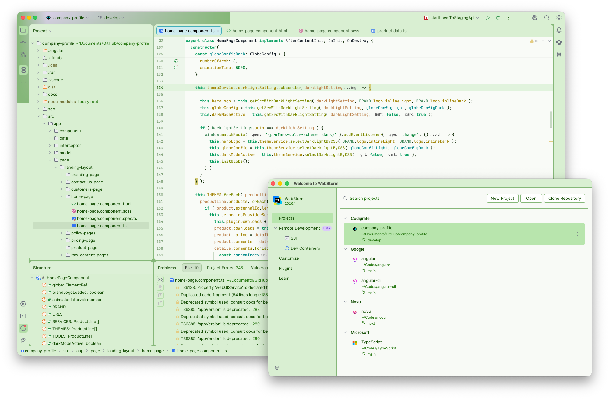

   

<h1 align="center">
Rio de Janeiro Theme
</h1>

## Description

Inspired by Rio’s lush hills, soft morning light, and ocean air, this theme blends airy minty
backgrounds with confident rainforest greens and clean coastal blues. The editor stays bright and
calm for long sessions, while crisp greens and balanced accents keep syntax readable and focused.

## Screenshots

## Color Palette

<table>
   <tr>
      <td></td>
      <td>
         Editor Background
      </td>
      <td>
         <a href="https://codigrate.com/en-US/tools/color/F7FAF6">#F7FAF6</a>
      </td>
   </tr>
   <tr>
      <td></td>
      <td>
         Window Background
      </td>
      <td>
         <a href="https://codigrate.com/en-US/tools/color/E1F3DD">#E1F3DD</a>
      </td>
   </tr>
   <tr>
      <td></td>
      <td>
         Selection Background
      </td>
      <td>
         <a href="https://codigrate.com/en-US/tools/color/CADFC2">#CADFC2</a>
      </td>
   </tr>
   <tr>
      <td></td>
      <td>
         Keywords
      </td>
      <td>
         <a href="https://codigrate.com/en-US/tools/color/5F9849">#5F9849</a>
      </td>
   </tr>
   <tr>
      <td></td>
      <td>
         Local Variables
      </td>
      <td>
         <a href="https://codigrate.com/en-US/tools/color/247A4C">#247A4C</a>
      </td>
   </tr>
   <tr>
      <td></td>
      <td>
         Strings
      </td>
      <td>
         <a href="https://codigrate.com/en-US/tools/color/0887B5">#0887B5</a>
      </td>
   </tr>
   <tr>
      <td></td>
      <td>
         Instance Fields
      </td>
      <td>
         <a href="https://codigrate.com/en-US/tools/color/7A6D14">#7A6D14</a>
      </td>
   </tr>
   <tr>
      <td></td>
      <td>
         Attributes
      </td>
      <td>
         <a href="https://codigrate.com/en-US/tools/color/938920">#938920</a>
      </td>
   </tr>
   <tr>
      <td></td>
      <td>
         Parameters
      </td>
      <td>
         <a href="https://codigrate.com/en-US/tools/color/A3620D">#A3620D</a>
      </td>
   </tr>
   <tr>
      <td></td>
      <td>
         Static Fields
      </td>
      <td>
         <a href="https://codigrate.com/en-US/tools/color/B65653">#B65653</a>
      </td>
   </tr>
</table>

## Getting Started

1. Install a compatible JetBrains IDE, such as IntelliJ IDEA, CLion, PyCharm, or other IntelliJ-based IDEs.
2. Launch the IDE and open plugin settings.
3. Search for **Rio de Janeiro Theme** and click install.
4. After installing the theme, go to **Settings | Appearance and Behavior | Appearance** and select **Rio de Janeiro
   Theme** in the theme dropdown. Once you have selected one of the theme options, click the OK button to apply the
   changes.

## Troubleshooting

There is a minor IntelliJ bug that you may face while updating the theme.
So, to not have that issue, please follow the steps below:

1. If you are using the theme that you want to update, select another theme first.
2. Then update the theme.
3. Then restart the ide.
4. Finally, switch it back to the theme that you updated.

## Contributors

<!-- ALL-CONTRIBUTORS-LIST:START - Do not remove or modify this section -->
<!-- prettier-ignore-start -->
<!-- markdownlint-disable -->
<table>
  <tr>
    <td align="center"><a href="https://github.com/furknyavuz"> <b>Furkan Yavuz</b></a> </td>
    <td align="center"><a href="https://github.com/kerimalp"> <b>Kerim Alp Kaya</b></a> </td>
  </tr>
</table>

<!-- markdownlint-enable -->
<!-- prettier-ignore-end -->

<!-- ALL-CONTRIBUTORS-LIST:END -->

## LICENSE

The source code for this project is released under the [MIT License](LICENSE).

