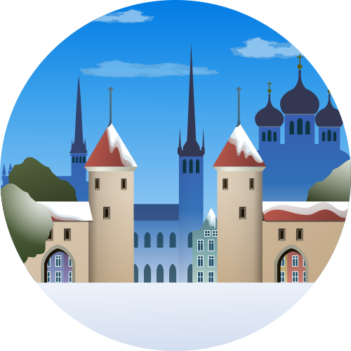
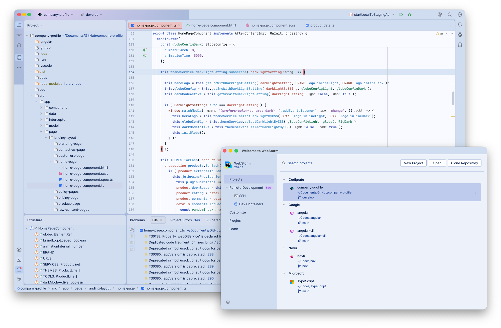

   

<h1 align="center">
Tallinn
</h1>

## Description

Inspired by Tallinn's crisp light and Baltic calm, this theme pairs airy porcelain backgrounds with cool 
Nordic blues for a clean, focused coding experience. Soft, bright surfaces enhance readability, while deep 
ink accents and subtle lavender-rose highlights add clarity and warmth without losing its minimal 
Northern character.

## Screenshots

## Color Palette

<table>
   <tr>
      <td></td>
      <td>
         Editor Background
      </td>
      <td>
         <a href="https://codigrate.com/en-US/tools/color/EDF2FA">#EDF2FA</a>
      </td>
   </tr>
   <tr>
      <td></td>
      <td>
         Window Background
      </td>
      <td>
         <a href="https://codigrate.com/en-US/tools/color/D0DCEF">#D0DCEF</a>
      </td>
   </tr>
   <tr>
      <td></td>
      <td>
         Instance Fields
      </td>
      <td>
         <a href="https://codigrate.com/en-US/tools/color/377CC1">#377CC1</a>
      </td>
   </tr>
   <tr>
      <td></td>
      <td>
         Keywords
      </td>
      <td>
         <a href="https://codigrate.com/en-US/tools/color/425EB8">#425EB8</a>
      </td>
   </tr>
   <tr>
      <td></td>
      <td>
         Accent Color
      </td>
      <td>
         <a href="https://codigrate.com/en-US/tools/color/324979">#324979</a>
      </td>
   </tr>
   <tr>
      <td></td>
      <td>
         Strings
      </td>
      <td>
         <a href="https://codigrate.com/en-US/tools/color/81549C">#81549C</a>
      </td>
   </tr>
   <tr>
      <td></td>
      <td>
         Tag Colors
      </td>
      <td>
         <a href="https://codigrate.com/en-US/tools/color/B1544B">#B1544B</a>
      </td>
   </tr>
   <tr>
      <td></td>
      <td>
         Parameters
      </td>
      <td>
         <a href="https://codigrate.com/en-US/tools/color/B6564B">#B6564B</a>
      </td>
   </tr>
   <tr>
      <td></td>
      <td>
         Metadata
      </td>
      <td>
         <a href="https://codigrate.com/en-US/tools/color/3D6A14">#3D6A14</a>
      </td>
   </tr>
   <tr>
      <td></td>
      <td>
         Static Fields
      </td>
      <td>
         <a href="https://codigrate.com/en-US/tools/color/548A64">#548A64</a>
      </td>
   </tr>
</table>

## Getting Started

1. Install a compatible JetBrains IDE, such as IntelliJ IDEA, CLion, PyCharm, or other IntelliJ-based IDEs.
2. Launch the IDE and open plugin settings.
3. Search for **Tallinn Theme** and click install.
4. After installing the theme, go to **Settings | Appearance and Behavior | Appearance** and select **Tallinn** in the theme dropdown. Once you have selected one of the theme options, click the OK button to apply the
   changes.

## Troubleshooting

There is a minor IntelliJ bug that you may face while updating the theme.
So, to not have that issue, please follow the steps below:

1. If you are using the theme that you want to update, select another theme first.
2. Then update the theme.
3. Then restart the ide.
4. Finally, switch it back to the theme that you updated.

## Contributors

<!-- ALL-CONTRIBUTORS-LIST:START - Do not remove or modify this section -->
<!-- prettier-ignore-start -->
<!-- markdownlint-disable -->
<table>
  <tr>
    <td align="center"><a href="https://github.com/furknyavuz"> <b>Furkan Yavuz</b></a> </td>
    <td align="center"><a href="https://github.com/kerimalp"> <b>Kerim Alp Kaya</b></a> </td>
  </tr>
</table>

<!-- markdownlint-enable -->
<!-- prettier-ignore-end -->

<!-- ALL-CONTRIBUTORS-LIST:END -->

## LICENSE

The source code for this project is released under the [MIT License](LICENSE).

