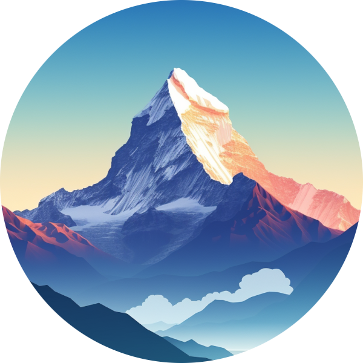
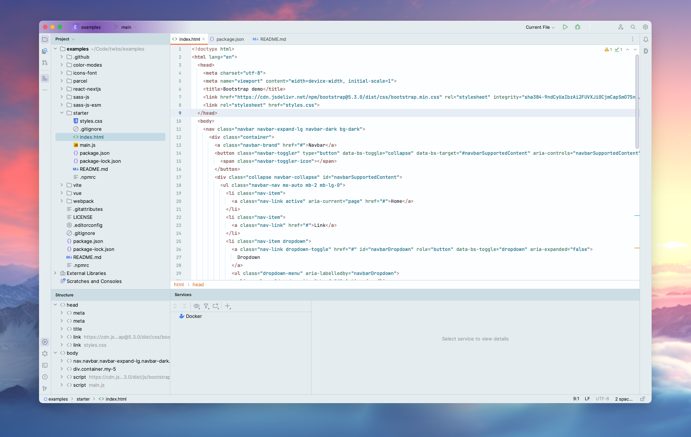
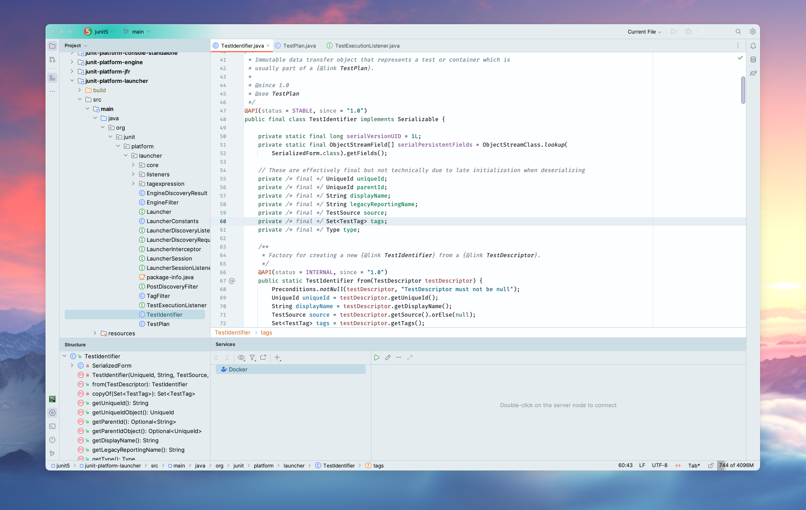

   

<h1 align="center">
Everest - Jetbrains Theme
</h1>

<!-- Plugin description -->
Everest-inspired theme for IntelliJ has a simple, colorful interface for better coding. It's designed to be easy on the eyes, helping you focus and code more efficiently.
<!-- Plugin description end -->

## Screenshots

## Contributors

<!-- ALL-CONTRIBUTORS-LIST:START - Do not remove or modify this section -->
<!-- prettier-ignore-start -->
<!-- markdownlint-disable -->
<table>
  <tr>
    <td align="center"><a href="https://github.com/furknyavuz"> <b>Furkan Yavuz</b></a> </td>
    <td align="center"><a href="https://github.com/kerimalp"> <b>Kerim Alp Kaya</b></a> </td>
  </tr>
</table>

<!-- markdownlint-enable -->
<!-- prettier-ignore-end -->

<!-- ALL-CONTRIBUTORS-LIST:END -->

## LICENSE

The source code for this project is released under the [MIT License](LICENSE).
