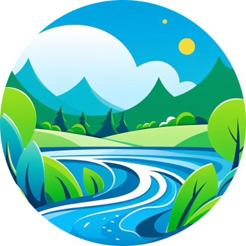

   

<h1 align="center">
Jetbrains Nature Themes
</h1>

<!-- Plugin description -->
Nature themes for JetBrains.

## Getting Started

1. Install a compatible JetBrains IDE, such as IntelliJ IDEA, CLion, PyCharm, or other IntelliJ-based IDEs.
2. Launch the IDE and open plugin settings.
3. Search for **the name of the theme** and click install.
4. After installing the theme, go to **Settings | Appearance and Behavior | Appearance** and select **the name of the
   theme** in the theme dropdown. Once you have selected one of the theme options, click the OK button to apply the
   changes.

<!-- Plugin description end -->

## Themes

<!-- THEMES-LIST:START - Do not remove or modify this section -->
<!-- prettier-ignore-start -->
<!-- markdownlint-disable -->
<table> 
   <tr>
      <td align="center">
         <a href="https://github.com/codigrate/jetbrains-themes/tree/main/nature-themes/aurora-borealis-theme">
            
             
            
               <b>Aurora Borealis Theme</b>
            
         </a>
      </td>
      <td align="left">
         <a href="https://plugins.jetbrains.com/plugin/22487-aurora-borealis-theme">
            
             
            
             
            
         </a>
      </td>
   </tr>
   <tr>
      <td align="center">
         <a href="https://github.com/codigrate/jetbrains-themes/tree/main/nature-themes/everest-theme">
            
             
            
               <b>Everest Theme</b>
            
         </a>
      </td>
      <td align="left">
         <a href="https://plugins.jetbrains.com/plugin/22653-everest-theme">
            
             
            
             
            
         </a>
      </td> 
   </tr>
   <tr>
      <td align="center">
         <a href="https://github.com/codigrate/jetbrains-themes/tree/main/nature-themes/autumn-theme">
            
             
            
               <b>Autumn Theme</b>
            
         </a>
      </td>
      <td align="left">
         <a href="https://plugins.jetbrains.com/plugin/22700-autumn-theme">
            
             
            
             
            
         </a>
      </td> 
   </tr>
   <tr>
      <td align="center">
         <a href="https://github.com/codigrate/jetbrains-themes/tree/main/nature-themes/sequoia-theme">
            
             
            
               <b>Sequoia Theme</b>
            
         </a>
      </td>
      <td align="left">
         <a href="https://plugins.jetbrains.com/plugin/22826-sequoia-theme">
            
             
            
             
            
         </a>
      </td>
   </tr>
   <tr>
      <td align="center">
         <a href="https://github.com/codigrate/jetbrains-themes/tree/main/nature-themes/sakura-theme">
            
             
            
               <b>Sakura Theme</b>
            
         </a>
      </td>
      <td align="left">
         <a href="https://plugins.jetbrains.com/plugin/22872-sakura-theme">
            
             
            
             
            
         </a>
      </td>
   </tr>
   <tr>
      <td align="center">
         <a href="https://github.com/codigrate/jetbrains-themes/tree/main/nature-themes/roraima-theme">
            
             
            
               <b>Roraima Theme</b>
            
         </a>
      </td>
      <td align="left">
         <a href="https://plugins.jetbrains.com/plugin/00000-roraima-theme">
            
             
            
             
            
         </a>
      </td>
   </tr>
</table>

<!-- markdownlint-enable -->
<!-- prettier-ignore-end -->

<!-- THEMES-LIST:END -->

## Contributors

<!-- ALL-CONTRIBUTORS-LIST:START - Do not remove or modify this section -->
<!-- prettier-ignore-start -->
<!-- markdownlint-disable -->
<table>
   <tr>
      <td align="center"><a href="https://github.com/furknyavuz"> <b>Furkan Yavuz</b></a> </td>
      <td align="center"><a href="https://github.com/kerimalp"> <b>Kerim Alp Kaya</b></a> </td>
   </tr>
</table>

<!-- markdownlint-enable -->
<!-- prettier-ignore-end -->

<!-- ALL-CONTRIBUTORS-LIST:END -->

## LICENSE

The source code for this project is released under the [MIT License](LICENSE).
