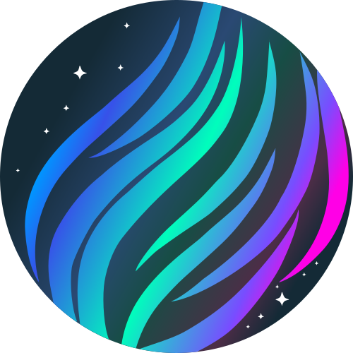
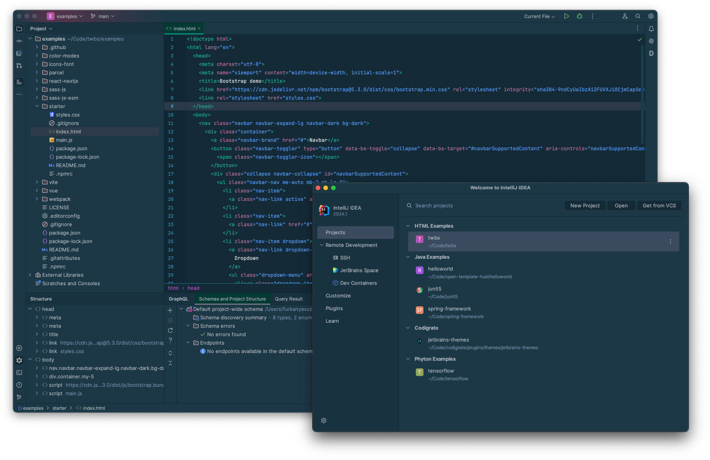
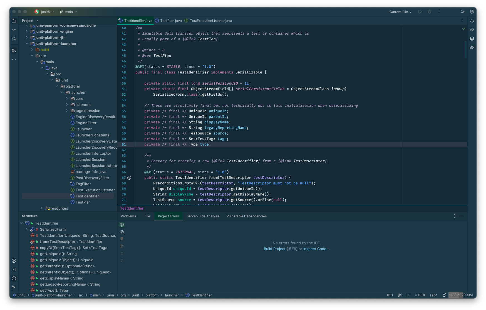
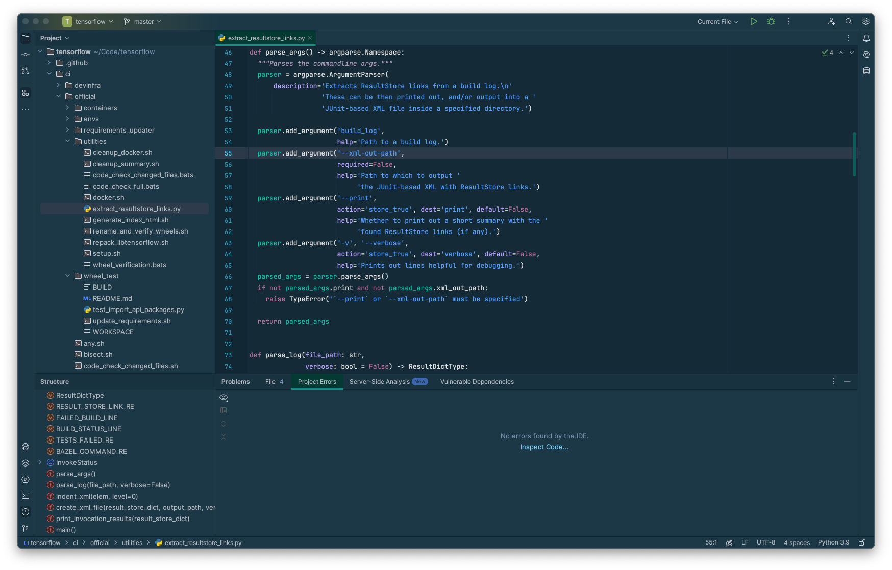

   

<h1 align="center">
Aurora Borealis - Jetbrains Theme
</h1>

## Description

Inspired by the natural phenomena of the Aurora Borealis, this dark theme captures the majesty and mystery of the Arctic
night sky. Dark blues and teals serve as the backdrop, while lighter accents echo the ethereal colors of the Northern
Lights. The palette is designed to be easy on the eyes, helping you focus, and code efficiently.

## Screenshots

## Color Palette

<table>
   <tr>
      <td></td>
      <td>
         Editor Background
      </td>
      <td>
         <a href="https://codigrate.com/en-US/tools/color/142A36">#142A36</a>
      </td>
   </tr>
   <tr>
      <td></td>
      <td>
         Menu Background
      </td>
      <td>
         <a href="https://codigrate.com/en-US/tools/color/1C3847">#1C3847</a>
      </td>
   </tr>
   <tr>
      <td></td>
      <td>
         Strings and Numbers
      </td>
      <td>
         <a href="https://codigrate.com/en-US/tools/color/549EFF">#549EFF</a>
      </td>
   </tr>
   <tr>
      <td></td>
      <td>
         Instance Fields
      </td>
      <td>
         <a href="https://codigrate.com/en-US/tools/color/7ACEF5">#7ACEF5</a>
      </td>
   </tr>
   <tr>
      <td></td>
      <td>
         Tab Colors
      </td>
      <td>
         <a href="https://codigrate.com/en-US/tools/color/043A33">#043A33</a>
      </td>
   </tr>
   <tr>
      <td></td>
      <td>
         Global Variables
      </td>
      <td>
         <a href="https://codigrate.com/en-US/tools/color/73D379">#73D379</a>
      </td>
   </tr>
   <tr>
      <td></td>
      <td>
         Local Variables
      </td>
      <td>
         <a href="https://codigrate.com/en-US/tools/color/05C0A6">#05C0A6</a>
      </td>
   </tr>
   <tr>
      <td></td>
      <td>
         Keywords
      </td>
      <td>
         <a href="https://codigrate.com/en-US/tools/color/BB719B">#BB719B</a>
      </td>
   </tr>
   <tr>
      <td></td>
      <td>
         Static Fields
      </td>
      <td>
         <a href="https://codigrate.com/en-US/tools/color/D193BB">#D193BB</a>
      </td>
   </tr>
   <tr>
      <td></td>
      <td>
         Parameters
      </td>
      <td>
         <a href="https://codigrate.com/en-US/tools/color/BAA5FF">#BAA5FF</a>
      </td>
   </tr>
</table>

## Getting Started

1. Install a compatible JetBrains IDE, such as IntelliJ IDEA, CLion, PyCharm, or other IntelliJ-based IDEs.
2. Launch the IDE and open plugin settings.
3. Search for **Aurora Borealis Theme** and click install.
4. After installing the theme, go to **Settings | Appearance and Behavior | Appearance** and select **Aurora Borealis
   Theme** in the theme dropdown. Once you have selected one of the theme options, click the OK button to apply the
   changes.

## Troubleshooting

There is a minor IntelliJ bug that you may face while updating the theme.
So, to not have that issue, please follow the steps below:

1. If you are using the theme that you want to update, select another theme first.
2. Then update the theme.
3. Then restart the ide.
4. Finally, switch it back to the theme that you updated.

## Contributors

<!-- ALL-CONTRIBUTORS-LIST:START - Do not remove or modify this section -->
<!-- prettier-ignore-start -->
<!-- markdownlint-disable -->
<table>
  <tr>
    <td align="center"><a href="https://github.com/furknyavuz"> <b>Furkan Yavuz</b></a> </td>
    <td align="center"><a href="https://github.com/kerimalp"> <b>Kerim Alp Kaya</b></a> </td>
  </tr>
</table>

<!-- markdownlint-enable -->
<!-- prettier-ignore-end -->

<!-- ALL-CONTRIBUTORS-LIST:END -->

## LICENSE

The source code for this project is released under the [MIT License](LICENSE).

