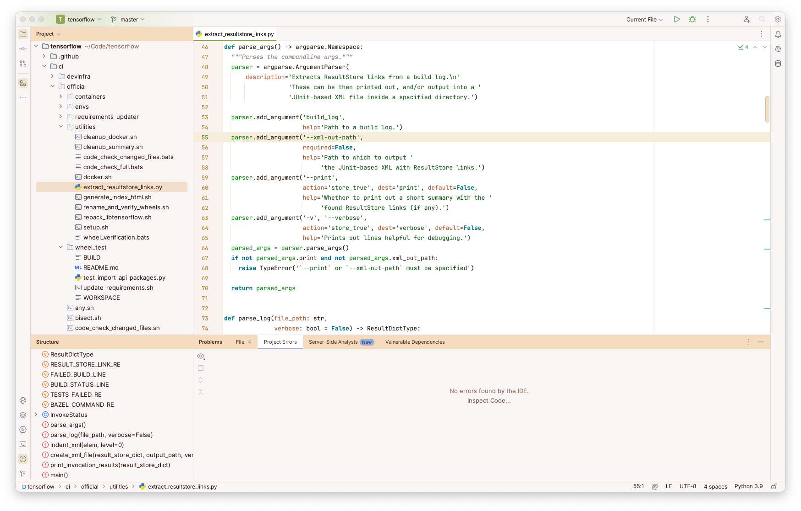

   

<h1 align="center">
Autumn - Jetbrains Theme
</h1>

## Description

Inspired by the warm hues and rustic feel of autumn, this light theme aims to evoke a sense of comfort and
tranquility. It blends soothing earth tones and crisp air-like whites, capturing the essence of fall leaves and late
afternoon sunlight. The palette is designed to be gentle on the eyes, promoting focus and productivity.

## Screenshots

## Color Palette

<table>
   <tr>
      <td></td>
      <td>
         Editor Background
      </td>
      <td>
         <a href="https://codigrate.com/en-US/tools/color/FDFEFF">#FDFEFF</a>
      </td>
   </tr>
   <tr>
      <td></td>
      <td>
         Selection Background
      </td>
      <td>
         <a href="https://codigrate.com/en-US/tools/color/F6DCBE">#F6DCBE</a>
      </td>
   </tr>
   <tr>
      <td></td>
      <td>
         Global Variables
      </td>
      <td>
         <a href="https://codigrate.com/en-US/tools/color/BE553E">#BE553E</a>
      </td>
   </tr>
   <tr>
      <td></td>
      <td>
         Metadata
      </td>
      <td>
         <a href="https://codigrate.com/en-US/tools/color/773918">#773918</a>
      </td>
   </tr>
   <tr>
      <td></td>
      <td>
         Parameters
      </td>
      <td>
         <a href="https://codigrate.com/en-US/tools/color/B0633A">#B0633A</a>
      </td>
   </tr>
   <tr>
      <td></td>
      <td>
         Instance Fields
      </td>
      <td>
         <a href="https://codigrate.com/en-US/tools/color/A87F25">#A87F25</a>
      </td>
   </tr>
   <tr>
      <td></td>
      <td>
         Alternate Background
      </td>
      <td>
         <a href="https://codigrate.com/en-US/tools/color/F5B211">#F5B211</a>
      </td>
   </tr>
   <tr>
      <td></td>
      <td>
         Strings and Numbers
      </td>
      <td>
         <a href="https://codigrate.com/en-US/tools/color/1B591E">#1B591E</a>
      </td>
   </tr>
   <tr>
      <td></td>
      <td>
         Local Variables
      </td>
      <td>
         <a href="https://codigrate.com/en-US/tools/color/0E8113">#0E8113</a>
      </td>
   </tr>
   <tr>
      <td></td>
      <td>
         Keywords
      </td>
      <td>
         <a href="https://codigrate.com/en-US/tools/color/006E83">#006E83</a>
      </td>
   </tr>
</table>

## Getting Started

1. Install a compatible JetBrains IDE, such as IntelliJ IDEA, CLion, PyCharm, or other IntelliJ-based IDEs.
2. Launch the IDE and open plugin settings.
3. Search for **Autumn Theme** and click install.
4. After installing the theme, go to **Settings | Appearance and Behavior | Appearance** and select **Autumn Theme** in
   the theme dropdown. Once you have selected one of the theme options, click the OK button to apply the changes.

## Troubleshooting

There is a minor IntelliJ bug that you may face while updating the theme.
So, to not have that issue, please follow the steps below:

1. If you are using the theme that you want to update, select another theme first.
2. Then update the theme.
3. Then restart the ide.
4. Finally, switch it back to the theme that you updated.

## Contributors

<!-- ALL-CONTRIBUTORS-LIST:START - Do not remove or modify this section -->
<!-- prettier-ignore-start -->
<!-- markdownlint-disable -->
<table>
  <tr>
    <td align="center"><a href="https://github.com/furknyavuz"> <b>Furkan Yavuz</b></a> </td>
    <td align="center"><a href="https://github.com/kerimalp"> <b>Kerim Alp Kaya</b></a> </td>
  </tr>
</table>

<!-- markdownlint-enable -->
<!-- prettier-ignore-end -->

<!-- ALL-CONTRIBUTORS-LIST:END -->

## LICENSE

The source code for this project is released under the [MIT License](LICENSE).
