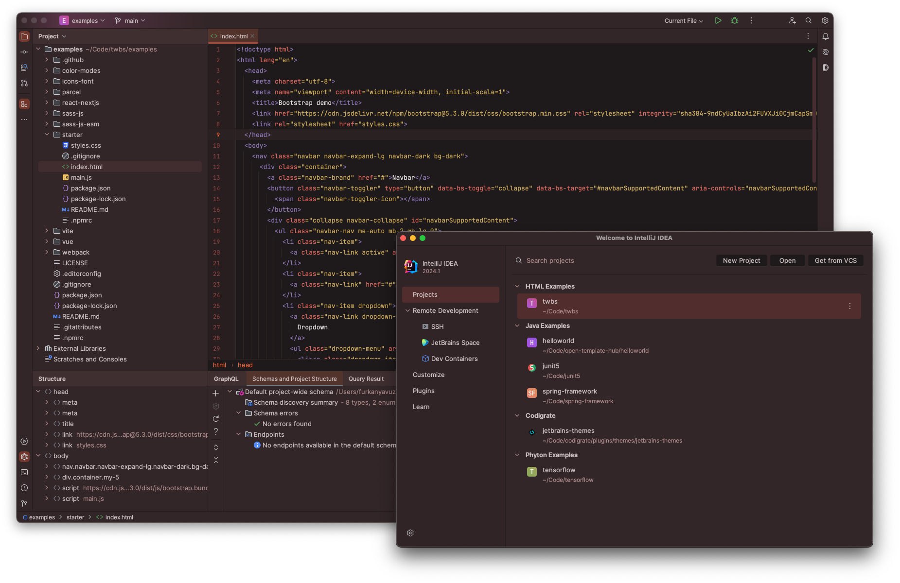
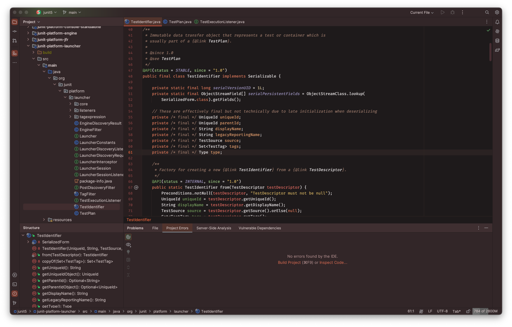
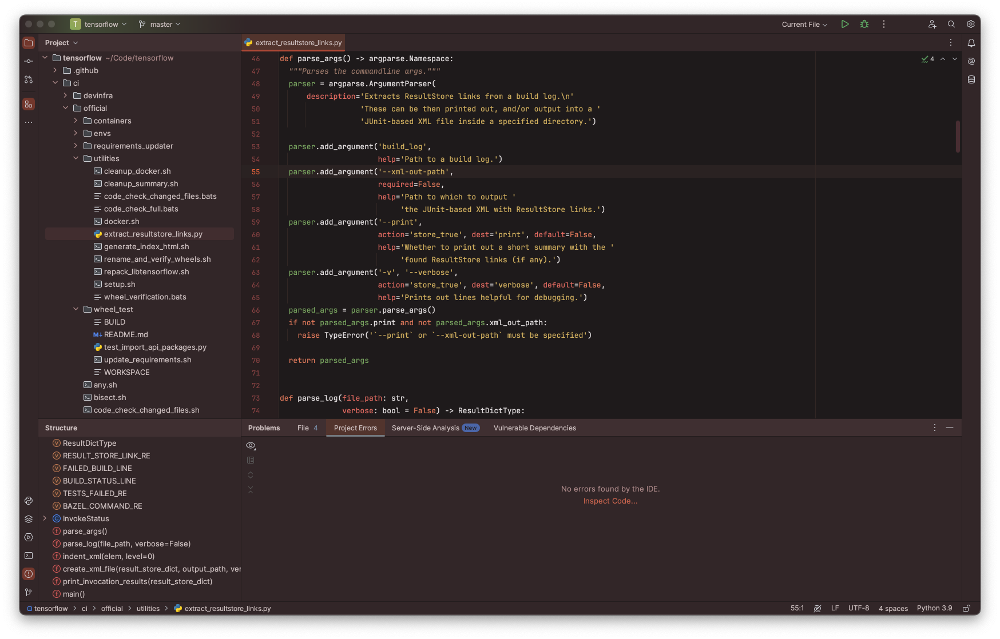

   

<h1 align="center">
Roraima - Jetbrains Theme
</h1>

## Description

Inspired by the captivating sunset over Mount Roraima, this dark theme seamlessly blends the deep twilight hues of 
blues and purples with the fiery brilliance of oranges and yellows. Evoking the serene majesty of Roraima as day 
transitions to night, this balanced palette offers a soothing yet invigorating backdrop, ensuring an optimal and 
focused coding experience.

## Screenshots

## Color Palette
<table>
   <tr>
      <td></td>
      <td>
         Editor Background
      </td>
      <td>
         <a href="https://codigrate.com/en-US/tools/color/1e1a1b">#1e1a1b</a>
      </td>
   </tr>
   <tr>
      <td></td>
      <td>
         Menu Background
      </td>
      <td>
         <a href="https://codigrate.com/en-US/tools/color/322628">#322628</a>
      </td>
   </tr>
   <tr>
      <td></td>
      <td>
         Selection Background
      </td>
      <td>
         <a href="https://codigrate.com/en-US/tools/color/522d2d">#522d2d</a>
      </td>
   </tr>
   <tr>
      <td></td>
      <td>
         Tabline Color
      </td>
      <td>
         <a href="https://codigrate.com/en-US/tools/color/ad4836">#ad4836</a>
      </td>
   </tr>
   <tr>
      <td></td>
      <td>
         Accent Color
      </td>
      <td>
         <a href="https://codigrate.com/en-US/tools/color/cc654e">#cc654e</a>
      </td>
   </tr>
   <tr>
      <td></td>
      <td>
         Keywords
      </td>
      <td>
         <a href="https://codigrate.com/en-US/tools/color/de785a">#de785a</a>
      </td>
   </tr>
   <tr>
      <td></td>
      <td>
         Strings
      </td>
      <td>
         <a href="https://codigrate.com/en-US/tools/color/d2b05f">#d2b05f</a>
      </td>
   </tr>
   <tr>
      <td></td>
      <td>
         Numbers
      </td>
      <td>
         <a href="https://codigrate.com/en-US/tools/color/d9c496">#d9c496</a>
      </td>
   </tr>
   <tr>
      <td></td>
      <td>
         Tags
      </td>
      <td>
         <a href="https://codigrate.com/en-US/tools/color/8f78b7">#8f78b7</a>
      </td>
   </tr>
   <tr>
      <td></td>
      <td>
         Static Fields
      </td>
      <td>
         <a href="https://codigrate.com/en-US/tools/color/9f95c2">#9f95c2</a>
      </td>
   </tr>
</table>

## Getting Started

1. Install a compatible JetBrains IDE, such as IntelliJ IDEA, CLion, PyCharm, or other IntelliJ-based IDEs.
2. Launch the IDE and open plugin settings.
3. Search for **Roraima Theme** and click install.
4. After installing the theme, go to **Settings | Appearance and Behavior | Appearance** and select **Roraima
   Theme** in the theme dropdown. Once you have selected one of the theme options, click the OK button to apply the
   changes.

## Troubleshooting

There is a minor IntelliJ bug that you may face while updating the theme.
So, to not have that issue, please follow the steps below:

1. If you are using the theme that you want to update, select another theme first.
2. Then update the theme.
3. Then restart the ide.
4. Finally, switch it back to the theme that you updated.

## Contributors

<!-- ALL-CONTRIBUTORS-LIST:START - Do not remove or modify this section -->
<!-- prettier-ignore-start -->
<!-- markdownlint-disable -->
<table>
  <tr>
    <td align="center"><a href="https://github.com/furknyavuz"> <b>Furkan Yavuz</b></a> </td>
    <td align="center"><a href="https://github.com/kerimalp"> <b>Kerim Alp Kaya</b></a> </td>
  </tr>
</table>

<!-- markdownlint-enable -->
<!-- prettier-ignore-end -->

<!-- ALL-CONTRIBUTORS-LIST:END -->

## LICENSE

The source code for this project is released under the [MIT License](LICENSE).

