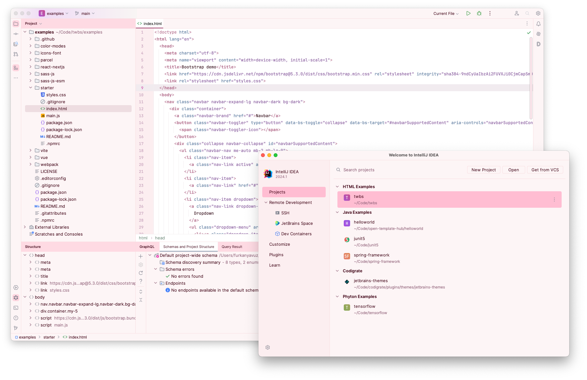
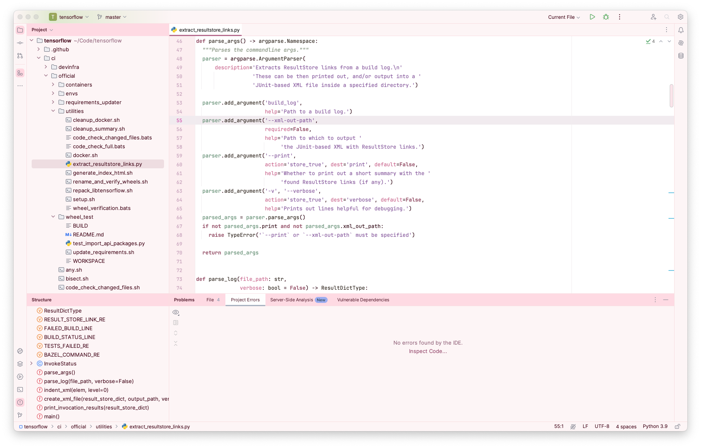

   

<h1 align="center">
Sakura - Jetbrains Theme
</h1>

## Description

Inspired by the enchanting allure of Sakura blossoms, this theme encapsulates the soft, calming essence of spring.
Delicate pinks serve as the backdrop, representing the blossoms, while muted greens and blues act as
complementary accents, reflecting the tranquil garden and clear sky. The palette, akin to a serene, blooming Sakura
garden, is designed to be easy on the eyes, aiding focus and efficient coding.

## Screenshots

## Color Palette

<table>
   <tr>
      <td align="center"><a href="https://codigrate.com/en-US/tools/color/FEFAFA"> <b>#FEFAFA</b> </a></td>
      <td align="center"><a href="https://codigrate.com/en-US/tools/color/FFD6E0"> <b>#FFD6E0</b> </a></td>
      <td align="center"><a href="https://codigrate.com/en-US/tools/color/FFBDD2"> <b>#FFBDD2</b> </a></td>
      <td align="center"><a href="https://codigrate.com/en-US/tools/color/CB6B91"> <b>#CB6B91</b> </a></td>
      <td align="center"><a href="https://codigrate.com/en-US/tools/color/98556C"> <b>#98556C</b> </a></td>
   </tr>
   <tr>
      <td align="center"><a href="https://codigrate.com/en-US/tools/color/D0DECE"> <b>#D0DECE</b> </a></td>
      <td align="center"><a href="https://codigrate.com/en-US/tools/color/618C71"> <b>#618C71</b> </a></td>
      <td align="center"><a href="https://codigrate.com/en-US/tools/color/69A2BD"> <b>#69A2BD</b> </a></td>
      <td align="center"><a href="https://codigrate.com/en-US/tools/color/607FA9"> <b>#607FA9</b> </a></td>
      <td align="center"><a href="https://codigrate.com/en-US/tools/color/687788"> <b>#687788</b> </a></td>
   </tr>
</table>

## Getting Started

1. Install a compatible JetBrains IDE, such as IntelliJ IDEA, CLion, PyCharm, or other IntelliJ-based IDEs.
2. Launch the IDE and open plugin settings.
3. Search for **Sakura Theme** and click install.
4. After installing the theme, go to **Settings | Appearance and Behavior | Appearance** and select **Sakura Theme** in
   the theme dropdown. Once you have selected one of the theme options, click the OK button to apply the changes.

## Troubleshooting

There is a minor IntelliJ bug that you may face while updating the theme.
So, to not have that issue, please follow the steps below:

1. If you are using the theme that you want to update, select another theme first.
2. Then update the theme.
3. Then restart the ide.
4. Finally, switch it back to the theme that you updated.

## Contributors

<!-- ALL-CONTRIBUTORS-LIST:START - Do not remove or modify this section -->
<!-- prettier-ignore-start -->
<!-- markdownlint-disable -->
<table>
  <tr>
    <td align="center"><a href="https://github.com/furknyavuz"> <b>Furkan Yavuz</b></a> </td>
    <td align="center"><a href="https://github.com/kerimalp"> <b>Kerim Alp Kaya</b></a> </td>
  </tr>
</table>

<!-- markdownlint-enable -->
<!-- prettier-ignore-end -->

<!-- ALL-CONTRIBUTORS-LIST:END -->

## LICENSE

The source code for this project is released under the [MIT License](LICENSE).
