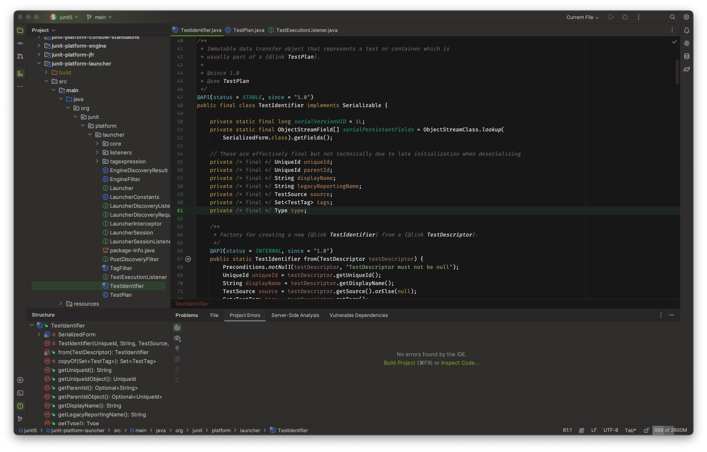

   

<h1 align="center">
Sequoia - Jetbrains Theme
</h1>

## Description

Inspired by the towering presence and serene environment of sequoias, the Sequoia Theme envelops your IDE in deep blacks
and browns, providing a calm and focused coding atmosphere. Accents of vibrant green illuminate the interface subtly,
mirroring the vitality of these magnificent trees. Venture into the digital woods with the Sequoia Theme, and let its
grounded, tranquil palette guide you through the logical forest of your code efficiently.

## Screenshots

## Color Palette
<table>
   <tr>
      <td></td>
      <td>
         Editor Background
      </td>
      <td>
         <a href="https://codigrate.com/en-US/tools/color/181717">#181717</a>
      </td>
   </tr>
   <tr>
      <td></td>
      <td>
         Menu Background
      </td>
      <td>
         <a href="https://codigrate.com/en-US/tools/color/302D2D">#302D2D</a>
      </td>
   </tr>
   <tr>
      <td></td>
      <td>
         Comments
      </td>
      <td>
         <a href="https://codigrate.com/en-US/tools/color/6C625A">#6C625A</a>
      </td>
   </tr>
   <tr>
      <td></td>
      <td>
         Local Variables
      </td>
      <td>
         <a href="https://codigrate.com/en-US/tools/color/A25B4E">#A25B4E</a>
      </td>
   </tr>
   <tr>
      <td></td>
      <td>
         Global Variables
      </td>
      <td>
         <a href="https://codigrate.com/en-US/tools/color/854F3C">#854F3C</a>
      </td>
   </tr>
   <tr>
      <td></td>
      <td>
         Instance Fields
      </td>
      <td>
         <a href="https://codigrate.com/en-US/tools/color/A67B5B">#A67B5B</a>
      </td>
   </tr>
   <tr>
      <td></td>
      <td>
         Keywords
      </td>
      <td>
         <a href="https://codigrate.com/en-US/tools/color/A88E4D">#A88E4D</a>
      </td>
   </tr>
   <tr>
      <td></td>
      <td>
         Hover Background
      </td>
      <td>
         <a href="https://codigrate.com/en-US/tools/color/374223">#374223</a>
      </td>
   </tr>
   <tr>
      <td></td>
      <td>
         Numbers
      </td>
      <td>
         <a href="https://codigrate.com/en-US/tools/color/6B9A58">#6B9A58</a>
      </td>
   </tr>
   <tr>
      <td></td>
      <td>
         Strings
      </td>
      <td>
         <a href="https://codigrate.com/en-US/tools/color/84A975">#84A975</a>
      </td>
   </tr>
</table>

## Getting Started

1. Install a compatible JetBrains IDE, such as IntelliJ IDEA, CLion, PyCharm, or other IntelliJ-based IDEs.
2. Launch the IDE and open plugin settings.
3. Search for **Sequoia Theme** and click install.
4. After installing the theme, go to **Settings | Appearance and Behavior | Appearance** and select **Sequoia
   Theme** in the theme dropdown. Once you have selected one of the theme options, click the OK button to apply the
   changes.

## Troubleshooting

There is a minor IntelliJ bug that you may face while updating the theme.
So, to not have that issue, please follow the steps below:

1. If you are using the theme that you want to update, select another theme first.
2. Then update the theme.
3. Then restart the ide.
4. Finally, switch it back to the theme that you updated.

## Contributors

<!-- ALL-CONTRIBUTORS-LIST:START - Do not remove or modify this section -->
<!-- prettier-ignore-start -->
<!-- markdownlint-disable -->
<table>
  <tr>
    <td align="center"><a href="https://github.com/furknyavuz"> <b>Furkan Yavuz</b></a> </td>
    <td align="center"><a href="https://github.com/kerimalp"> <b>Kerim Alp Kaya</b></a> </td>
  </tr>
</table>

<!-- markdownlint-enable -->
<!-- prettier-ignore-end -->

<!-- ALL-CONTRIBUTORS-LIST:END -->

## LICENSE

The source code for this project is released under the [MIT License](LICENSE).
