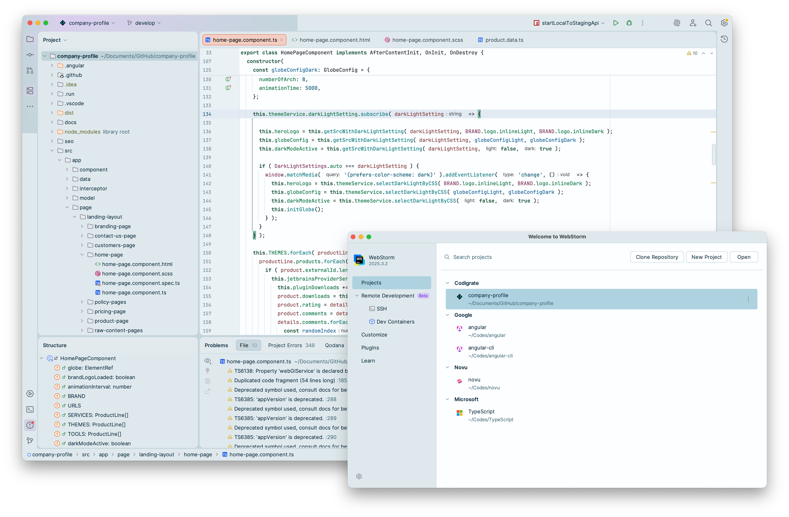

   

<h1 align="center">
Everest Theme
</h1>

## Description

Inspired by the majestic heights and serene landscapes of Mount Everest, this light theme aims to provide a calming and
focused coding environment. The soft blues and grays mimic the icy terrains, while subtle hints of warmer colors evoke
the golden hues of dawn breaking over snow-capped peaks.

## Screenshots

## Color Palette
<table>
   <tr>
      <td></td>
      <td>
         Editor Background
      </td>
      <td>
         <a href="https://codigrate.com/en-US/tools/color/FDFEFF">#FDFEFF</a>
      </td>
   </tr>
   <tr>
      <td></td>
      <td>
         Window Background
      </td>
      <td>
         <a href="https://codigrate.com/en-US/tools/color/E4ECEF">#E4ECEF</a>
      </td>
   </tr>
   <tr>
      <td></td>
      <td>
         Local Variables
      </td>
      <td>
         <a href="https://codigrate.com/en-US/tools/color/1A6D9F">#1A6D9F</a>
      </td>
   </tr>
   <tr>
      <td></td>
      <td>
         Strings and Numbers
      </td>
      <td>
         <a href="https://codigrate.com/en-US/tools/color/005E79">#005E79</a>
      </td>
   </tr>
   <tr>
      <td></td>
      <td>
         Instance Fields
      </td>
      <td>
         <a href="https://codigrate.com/en-US/tools/color/007A47">#007A47</a>
      </td>
   </tr>
   <tr>
      <td></td>
      <td>
         Keywords
      </td>
      <td>
         <a href="https://codigrate.com/en-US/tools/color/2E674F">#2E674F</a>
      </td>
   </tr>
   <tr>
      <td></td>
      <td>
         Static Fields
      </td>
      <td>
         <a href="https://codigrate.com/en-US/tools/color/83529B">#83529B</a>
      </td>
   </tr>
   <tr>
      <td></td>
      <td>
         Global Variables
      </td>
      <td>
         <a href="https://codigrate.com/en-US/tools/color/8C4069">#8C4069</a>
      </td>
   </tr>
   <tr>
      <td></td>
      <td>
         Active Border Colors
      </td>
      <td>
         <a href="https://codigrate.com/en-US/tools/color/ED7E5A">#ED7E5A</a>
      </td>
   </tr>
   <tr>
      <td></td>
      <td>
         Parameters
      </td>
      <td>
         <a href="https://codigrate.com/en-US/tools/color/8F4446">#8F4446</a>
      </td>
   </tr>
</table>

## Getting Started

1. Install a compatible JetBrains IDE, such as IntelliJ IDEA, CLion, PyCharm, or other IntelliJ-based IDEs.
2. Launch the IDE and open plugin settings.
3. Search for **Everest Theme** and click install.
4. After installing the theme, go to **Settings | Appearance and Behavior | Appearance** and select **Everest Theme** in
   the theme dropdown. Once you have selected one of the theme options, click the OK button to apply the changes.

## Troubleshooting

There is a minor IntelliJ bug that you may face while updating the theme.
So, to not have that issue, please follow the steps below:

1. If you are using the theme that you want to update, select another theme first.
2. Then update the theme.
3. Then restart the ide.
4. Finally, switch it back to the theme that you updated.

## Contributors

<!-- ALL-CONTRIBUTORS-LIST:START - Do not remove or modify this section -->
<!-- prettier-ignore-start -->
<!-- markdownlint-disable -->
<table>
  <tr>
    <td align="center"><a href="https://github.com/furknyavuz"> <b>Furkan Yavuz</b></a> </td>
    <td align="center"><a href="https://github.com/kerimalp"> <b>Kerim Alp Kaya</b></a> </td>
  </tr>
</table>

<!-- markdownlint-enable -->
<!-- prettier-ignore-end -->

<!-- ALL-CONTRIBUTORS-LIST:END -->

## LICENSE

The source code for this project is released under the [MIT License](LICENSE).
