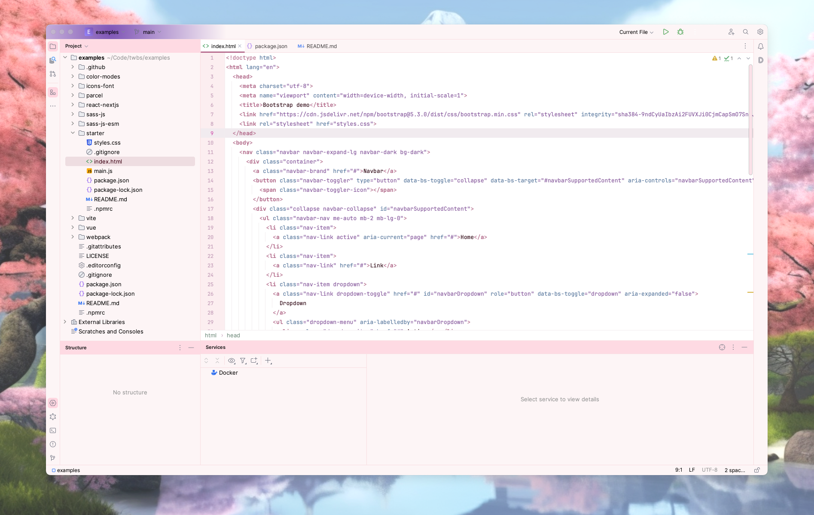
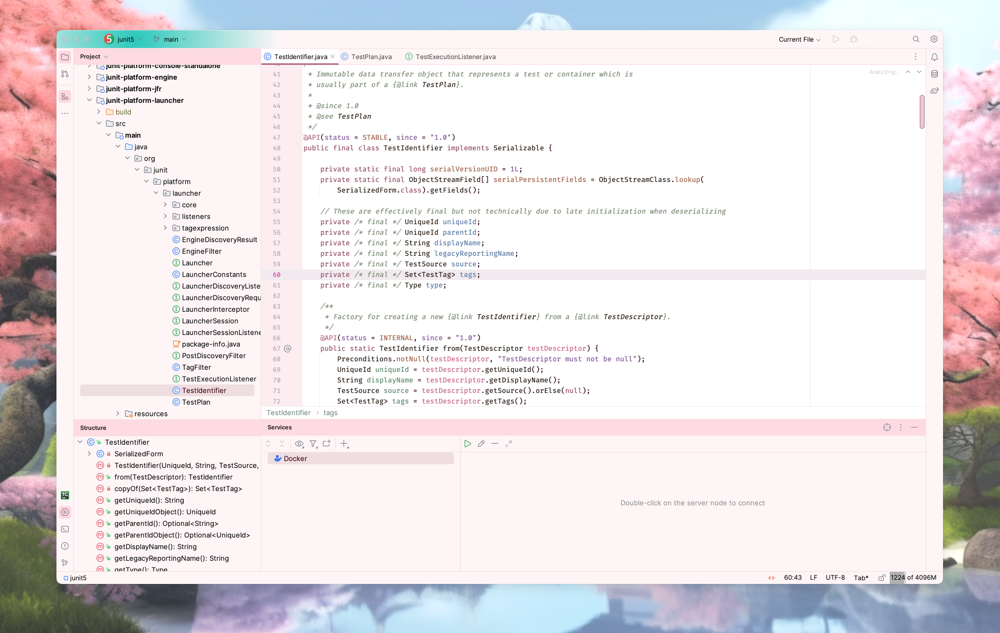
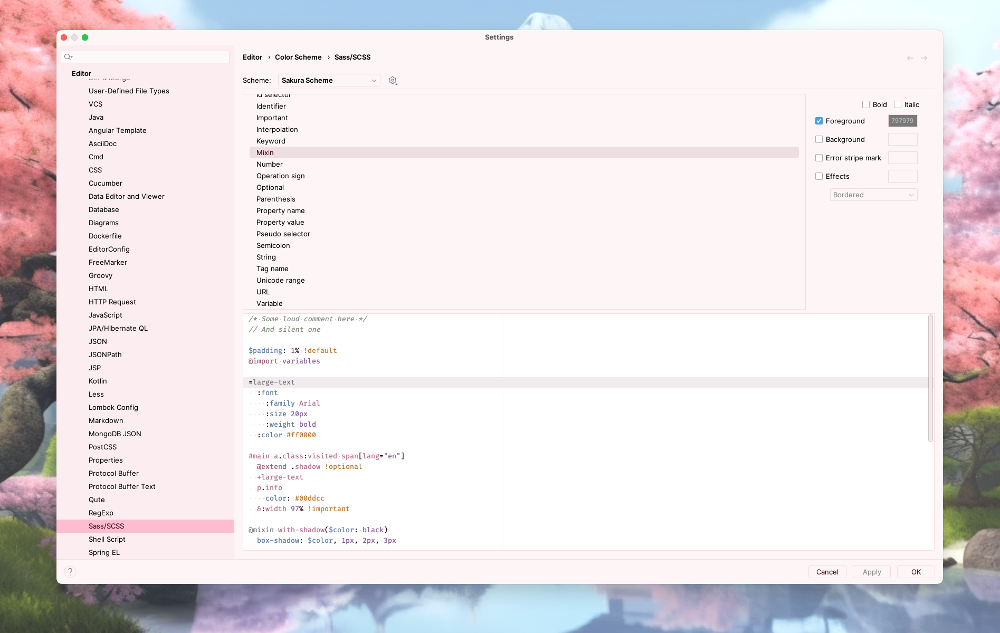
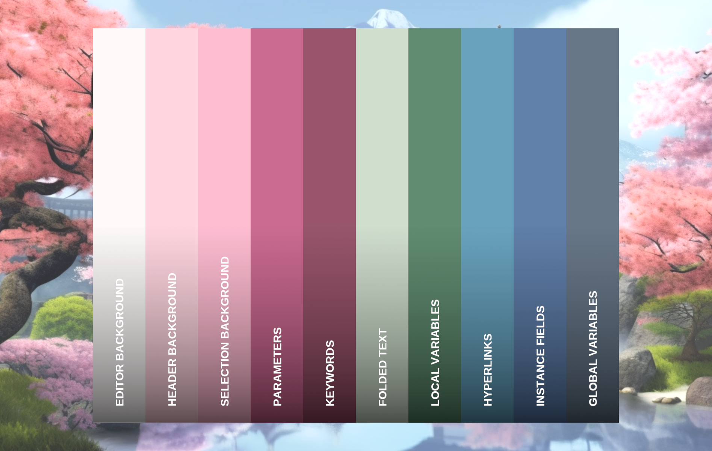

   

<h1 align="center">
Sakura - Jetbrains Theme
</h1>

## Description

Inspired by the warm hues and rustic feel of sakura, this light theme aims to evoke a sense of comfort and
tranquility. It blends soothing earth tones and crisp air-like whites, capturing the essence of fall leaves and late
afternoon sunlight. The palette is designed to be gentle on the eyes, promoting focus and productivity.

## Screenshots

## Color Palette

<table>
   <tr>
      <td align="center"> <b>#FFFFFF</b> </td>
      <td align="center"> <b>#F6C7B9</b> </td>
      <td align="center"> <b>#BE553E</b> </td>
      <td align="center"> <b>#773918</b> </td>
      <td align="center"> <b>#B0633A</b> </td>
   </tr>
   <tr>
      <td align="center"> <b>#A87F25</b> </td>
      <td align="center"> <b>#F5B211</b> </td>
      <td align="center"> <b>#1B591E</b> </td>
      <td align="center"> <b>#0E8113</b> </td>
      <td align="center"> <b>#006E83</b> </td>
   </tr>
</table>

## Getting Started

1. Install a compatible JetBrains IDE, such as IntelliJ IDEA, CLion, PyCharm, or other IntelliJ-based IDEs.
2. Launch the IDE and open plugin settings.
3. Search for **Sakura Theme** and click install.
4. After installing the theme, go to **Settings | Appearance and Behavior | Appearance** and select **Sakura Theme** in
   the theme dropdown. Once you have selected one of the theme options, click the OK button to apply the changes.

## What's Next

#### 1.0.6

* Update editor colors

## What's New

#### 1.0.5

* Update description

#### 1.0.4

* Update icon

#### 1.0.3

* Update editor colors

#### 1.0.2

* Update icon and editor colors

#### 1.0.1

* Update identifier background color

#### 1.0.0

* Initial version

## Contributors

<!-- ALL-CONTRIBUTORS-LIST:START - Do not remove or modify this section -->
<!-- prettier-ignore-start -->
<!-- markdownlint-disable -->
<table>
  <tr>
    <td align="center"><a href="https://github.com/furknyavuz"> <b>Furkan Yavuz</b></a> </td>
    <td align="center"><a href="https://github.com/kerimalp"> <b>Kerim Alp Kaya</b></a> </td>
  </tr>
</table>

<!-- markdownlint-enable -->
<!-- prettier-ignore-end -->

<!-- ALL-CONTRIBUTORS-LIST:END -->

## LICENSE

The source code for this project is released under the [MIT License](LICENSE).
