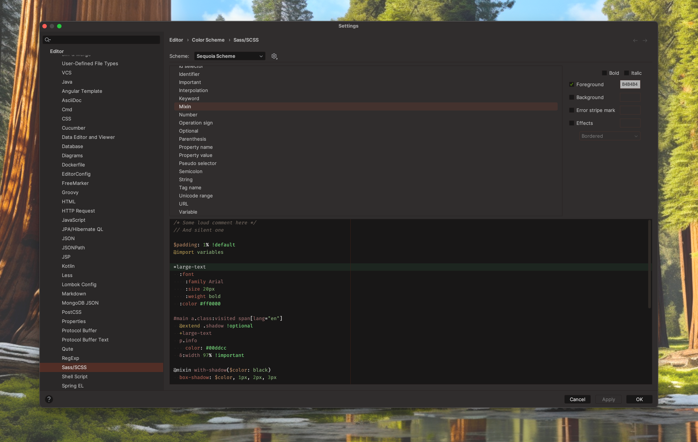
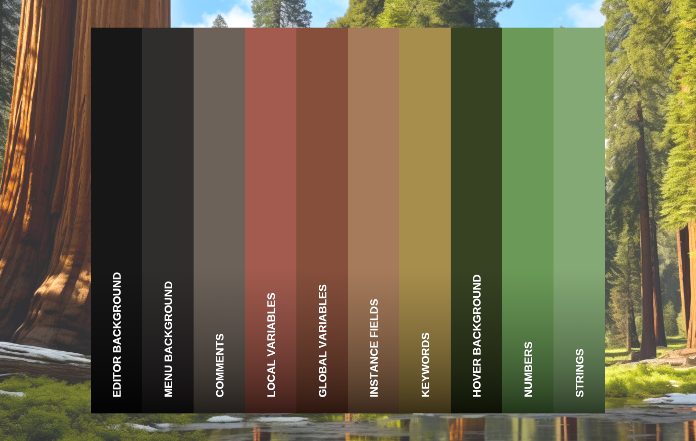

   

<h1 align="center">
Sequoia - Jetbrains Theme
</h1>

## Description

Inspired by the natural phenomena of the Sequoia, this dark theme captures the majesty and mystery of the Arctic
night sky. Dark blues and teals serve as the backdrop, while lighter accents echo the ethereal colors of the Northern
Lights. The palette is designed to be easy on the eyes, helping you focus, and code efficiently.

## Screenshots

## Color Palette

<table>
   <tr>
      <td align="center"> <b>#142A36</b> </td>
      <td align="center"> <b>#1C3847</b> </td>
      <td align="center"> <b>#549EFF</b> </td>
      <td align="center"> <b>#7ACEF5</b> </td>
      <td align="center"> <b>#043A33</b> </td>
   </tr>
   <tr>
      <td align="center"> <b>#73D379</b> </td>
      <td align="center"> <b>#05C0A6</b> </td>
      <td align="center"> <b>#BB719B</b> </td>
      <td align="center"> <b>#D193BB</b> </td>
      <td align="center"> <b>#BAA5FF</b> </td>
   </tr>
</table>

## Getting Started

1. Install a compatible JetBrains IDE, such as IntelliJ IDEA, CLion, PyCharm, or other IntelliJ-based IDEs.
2. Launch the IDE and open plugin settings.
3. Search for **Sequoia Theme** and click install.
4. After installing the theme, go to **Settings | Appearance and Behavior | Appearance** and select **Sequoia
   Theme** in the theme dropdown. Once you have selected one of the theme options, click the OK button to apply the
   changes.

## What's Next

#### 1.0.10

* Update editor colors

## What's New

#### 1.0.9

* Update description

#### 1.0.8

* Update icon

#### 1.0.7

* Update icon

#### 1.0.6

* Update identifier background color

#### 1.0.5

* Update Search Match Background Colors

#### 1.0.4

* Update implicit anonymous class parameter attribute colors

#### 1.0.3

* Update install and update button colors
* Update selection background color

#### 1.0.2

* Update docs

#### 1.0.1

* Update menu colors

#### 1.0.0

* Initial version

## Contributors

<!-- ALL-CONTRIBUTORS-LIST:START - Do not remove or modify this section -->
<!-- prettier-ignore-start -->
<!-- markdownlint-disable -->
<table>
  <tr>
    <td align="center"><a href="https://github.com/furknyavuz"> <b>Furkan Yavuz</b></a> </td>
    <td align="center"><a href="https://github.com/kerimalp"> <b>Kerim Alp Kaya</b></a> </td>
  </tr>
</table>

<!-- markdownlint-enable -->
<!-- prettier-ignore-end -->

<!-- ALL-CONTRIBUTORS-LIST:END -->

## LICENSE

The source code for this project is released under the [MIT License](LICENSE).
